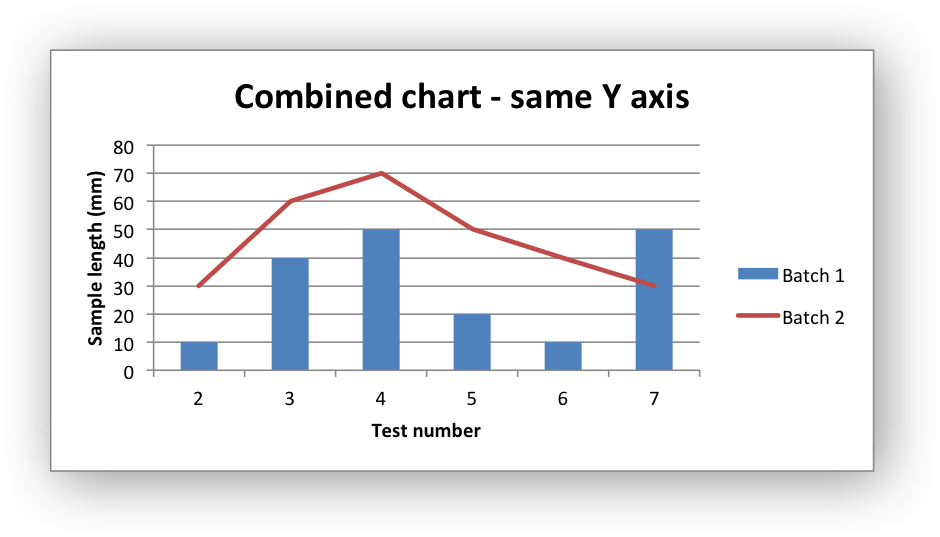
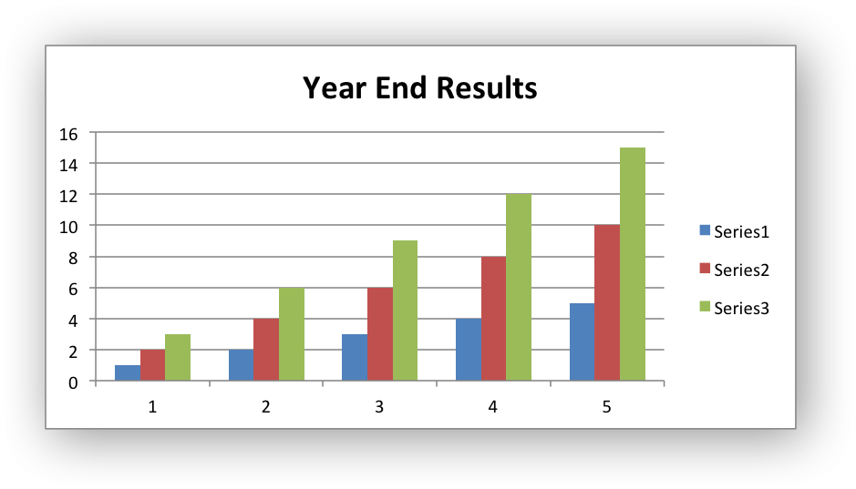
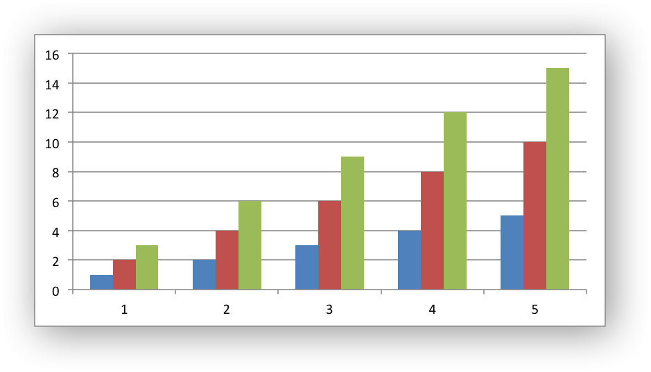
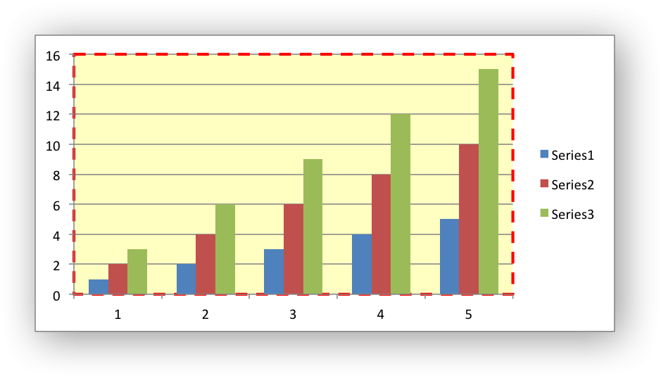

.. _chart_class:

The Chart Class
===============

The ``Chart`` module is a base class for modules that implement charts in
XlsxWriter. The information in this section is applicable to all of the
available chart subclasses, such as Area, Bar, Column, Doughnut, Line, Pie,
Scatter, Stock and Radar.

A chart object is created via the Workbook :func:`add_chart()` method where the
chart type is specified::

    chart = workbook.add_chart({type, 'column'})

It is then inserted into a worksheet as an embedded chart using the
:func:`insert_chart` Worksheet method::

    worksheet.insert_chart('A7', chart)

Or it can be set in a chartsheet using the :func:`set_chart` Chartsheet method::

    chartsheet = workbook.add_chartsheet()
    # ...
    chartsheet.set_chart(chart)

The following is a small working example or adding an embedded chart::

    import xlsxwriter

    workbook = xlsxwriter.Workbook('chart.xlsx')
    worksheet = workbook.add_worksheet()

    # Create a new Chart object.
    chart = workbook.add_chart({'type': 'column'})

    # Write some data to add to plot on the chart.
    data = [
        [1, 2, 3, 4, 5],
        [2, 4, 6, 8, 10],
        [3, 6, 9, 12, 15],
    ]

    worksheet.write_column('A1', data[0])
    worksheet.write_column('B1', data[1])
    worksheet.write_column('C1', data[2])

    # Configure the chart. In simplest case we add one or more data series.
    chart.add_series({'values': '=Sheet1!$A$1:$A$5'})
    chart.add_series({'values': '=Sheet1!$B$1:$B$5'})
    chart.add_series({'values': '=Sheet1!$C$1:$C$5'})

    # Insert the chart into the worksheet.
    worksheet.insert_chart('A7', chart)

    workbook.close()

.. image:: _images/chart_simple.png
   :scale: 75 %

The supported chart types are:

* ``area``: Creates an Area (filled line) style chart.

* ``bar``: Creates a Bar style (transposed histogram) chart.

* ``column``: Creates a column style (histogram) chart.

* ``line``: Creates a Line style chart.

* ``pie``: Creates a Pie style chart.

* ``doughnut``: Creates a Doughnut style chart.

* ``scatter``: Creates a Scatter style chart.

* ``stock``: Creates a Stock style chart.

* ``radar``: Creates a Radar style chart.

Chart subtypes are also supported for some chart types::

    workbook.add_chart({'type': 'bar', 'subtype': 'stacked'})

The available subtypes are::

    area
        stacked
        percent_stacked

    bar
        stacked
        percent_stacked

    column
        stacked
        percent_stacked

    scatter
        straight_with_markers
        straight
        smooth_with_markers
        smooth

    radar
        with_markers
        filled

Methods that are common to all chart types are documented below. See
:ref:`working_with_charts` for chart specific information.

chart.add_series()
------------------

.. py:function:: add_series(options)

   Add a data series to a chart.

   :param dict options: A dictionary of chart series options.

In Excel a chart **series** is a collection of information that defines which
data is plotted such as values, axis labels and formatting.

For an XlsxWriter chart object the ``add_series()`` method is used to set the
properties for a series::

    chart.add_series({
        'categories': '=Sheet1!$A$1:$A$5',
        'values':     '=Sheet1!$B$1:$B$5',
        'line':       {'color': 'red'},
    })

    # Or using a list of values instead of category/value formulas:
    #     [sheetname, first_row, first_col, last_row, last_col]
    chart.add_series({
        'categories': ['Sheet1', 0, 0, 4, 0],
        'values':     ['Sheet1', 0, 1, 4, 1],
        'line':       {'color': 'red'},
    })

As shown above the ``categories`` and ``values`` can take either a range
formula such as ``=Sheet1!$A$2:$A$7`` or, more usefully when generating the
range programmatically, a list with zero indexed row/column values.

The series options that can be set are:

* ``values``: This is the most important property of a series and is the only
  mandatory option for every chart object. This option links the chart with
  the worksheet data that it displays. The data range can be set using a
  formula as shown in the first example above or using a list of values as
  shown in the second example.

* ``categories``: This sets the chart category labels. The category is more
  or less the same as the X axis. In most chart types the ``categories``
  property is optional and the chart will just assume a sequential series from
  ``1..n``.

* ``name``: Set the name for the series. The name is displayed in the chart
  legend and in the formula bar. The name property is optional and if it isn't
  supplied it will default to ``Series 1..n``. The name can also be a formula
  such as ``=Sheet1!$A$1`` or a list with a sheetname, row and column such as
  ``['Sheet1', 0, 0]``.

* ``line``: Set the properties of the series line type such as color and
  width. See :ref:`chart_formatting_line`.

* ``border``: Set the border properties of the series such as color and
  style. See :ref:`chart_formatting_border`.

* ``fill``: Set the solid fill properties of the series such as color. See
  :ref:`chart_formatting_fill`.

* ``pattern``: Set the pattern fill properties of the series. See
  :ref:`chart_formatting_pattern`.

* ``gradient``: Set the gradient fill properties of the series. See
  :ref:`chart_formatting_gradient`.

* ``marker``: Set the properties of the series marker such as style and
  color. See :ref:`chart_series_option_marker`.

* ``trendline``: Set the properties of the series trendline such as linear,
  polynomial and moving average types. See
  :ref:`chart_series_option_trendline`.

* ``smooth``: Set the smooth property of a line series.

* ``y_error_bars``: Set vertical error bounds for a chart series. See
  :ref:`chart_series_option_error_bars`.

* ``x_error_bars``: Set horizontal error bounds for a chart series. See
  :ref:`chart_series_option_error_bars`.

* ``data_labels``: Set data labels for the series. See
  :ref:`chart_series_option_data_labels`.

* ``points``: Set properties for individual points in a series. See
  :ref:`chart_series_option_points`.

* ``invert_if_negative``: Invert the fill color for negative values. Usually
  only applicable to column and bar charts.

* ``overlap``: Set the overlap between series in a Bar/Column chart. The
  range is +/- 100. The default is 0::

    chart.add_series({
        'categories': '=Sheet1!$A$1:$A$5',
        'values':     '=Sheet1!$B$1:$B$5',
        'overlap':    10,
    })

  Note, it is only necessary to apply the ``overlap`` property to one series
  in the chart.

* ``gap``: Set the gap between series in a Bar/Column chart. The range is 0
  to 500. The default is 150::

    chart.add_series({
        'categories': '=Sheet1!$A$1:$A$5',
        'values':     '=Sheet1!$B$1:$B$5',
        'gap':        200,
    })

  Note, it is only necessary to apply the ``gap`` property to one series in
  the chart.

More than one series can be added to a chart. In fact, some chart types such as
``stock`` require it. The series numbering and order in the Excel chart will
be the same as the order in which they are added in XlsxWriter.

It is also possible to specify non-contiguous ranges::

    chart.add_series({
        'categories': '=(Sheet1!$A$1:$A$9,Sheet1!$A$14:$A$25)',
        'values':     '=(Sheet1!$B$1:$B$9,Sheet1!$B$14:$B$25)',
    })

chart.set_x_axis()
------------------

.. py:function:: set_x_axis(options)

   Set the chart X axis options.

   :param dict options: A dictionary of axis options.

The ``set_x_axis()`` method is used to set properties of the X axis::

    chart.set_x_axis({
        'name': 'Earnings per Quarter',
        'name_font': {'size': 14, 'bold': True},
        'num_font':  {'italic': True },
    })

.. image:: _images/chart_x_axis.png
   :scale: 75 %

The options that can be set are::

    name
    name_font
    name_layout
    num_font
    num_format
    line
    fill
    pattern
    gradient
    min
    max
    minor_unit
    major_unit
    interval_unit
    interval_tick
    crossing
    position_axis
    reverse
    log_base
    label_position
    major_gridlines
    minor_gridlines
    visible
    date_axis
    text_axis
    minor_unit_type
    major_unit_type
    minor_tick_mark
    major_tick_mark
    display_units
    display_units_visible

These options are explained below. Some properties are only applicable to
**value**, **category** or **date** axes (this is noted in each case). See
:ref:`chart_val_cat_axes` for an explanation of Excel's distinction between
the axis types.

* ``name``: Set the name (also known as title or caption) for the axis. The
  name is displayed below the X axis. (Applicable to category, date and value
  axes.)::

    chart.set_x_axis({'name': 'Earnings per Quarter'})

  This property is optional. The default is to have no axis name.

  The name can also be a formula such as ``=Sheet1!$A$1`` or a list with a
  sheetname, row and column such as ``['Sheet1', 0, 0]``.

* ``name_font``: Set the font properties for the axis name. (Applicable to
  category, date and value axes.)::

    chart.set_x_axis({'name_font': {'bold': True, 'italic': True}})

  See the :ref:`chart_fonts` section for more details on font properties.

* ``name_layout``: Set the ``(x, y)`` position of the axis caption in chart
  relative units. (Applicable to category, date and value axes.)::

    chart.set_x_axis({
        'name': 'X axis',
        'name_layout': {
            'x': 0.34,
            'y': 0.85,
        }
    })

  See the :ref:`chart_layout` section for more details.

* ``num_font``: Set the font properties for the axis numbers. (Applicable to
  category, date and value axes.)::

    chart.set_x_axis({'name_font': {'bold': True, 'italic': True}})

  See the :ref:`chart_fonts` section for more details on font properties.

* ``num_format``: Set the number format for the axis. (Applicable to
  category, date and value axes.)::

    chart.set_x_axis({'num_format': '#,##0.00'})
    chart.set_y_axis({'num_format': '0.00%'})

  The number format is similar to the Worksheet Cell Format ``num_format``
  apart from the fact that a format index cannot be used. An explicit format
  string must be used as shown above. See :func:`set_num_format()` for more
  information.

* ``line``: Set the properties of the axis line type such as color and
  width. See :ref:`chart_formatting_line`::

    chart.set_x_axis({'line': {'none': True}})

* ``fill``: Set the solid fill properties of the axis such as color. See
  :ref:`chart_formatting_fill`.  Note, in Excel the axis fill is applied to
  the area of the numbers of the axis and not to the area of the axis bounding
  box. That background is set from the chartarea fill.

* ``pattern``: Set the pattern fill properties of the axis. See
  :ref:`chart_formatting_pattern`.

* ``gradient``: Set the gradient fill properties of the axis. See
  :ref:`chart_formatting_gradient`.

* ``min``: Set the minimum value for the axis range. (Applicable to value and
  date axes only.)::

    chart.set_x_axis({'min': 3, 'max': 6})

  .. image:: _images/chart_max_min.png
     :scale: 75 %

* ``max``: Set the maximum value for the axis range. (Applicable to value and
  date axes only.)

* ``minor_unit``: Set the increment of the minor units in the axis range.
  (Applicable to value and date axes only.)::

    chart.set_x_axis({'minor_unit': 0.4, 'major_unit': 2})

* ``major_unit``: Set the increment of the major units in the axis range.
  (Applicable to value and date axes only.)

* ``interval_unit``: Set the interval unit for a category axis. Should be an
  integer value. (Applicable to category axes only.)::

    chart.set_x_axis({'interval_unit': 5})

* ``interval_tick``: Set the tick interval for a category axis. Should be an
  integer value. (Applicable to category axes only.)::

    chart.set_x_axis({'interval_tick': 2})

* ``crossing``: Set the position where the y axis will cross the x axis.
  (Applicable to all axes.)

  The ``crossing`` value can either be the string ``'max'`` to set the
  crossing at the maximum axis value or a numeric value::

    chart.set_x_axis({'crossing': 3})
    chart.set_y_axis({'crossing': 'max'})

  **For category axes the numeric value must be an integer** to represent the
  category number that the axis crosses at. For value and date axes it can
  have any value associated with the axis. See also :ref:`chart_val_cat_axes`.

  If crossing is omitted (the default) the crossing will be set automatically
  by Excel based on the chart data.

* ``position_axis``: Position the axis on or between the axis tick marks.
  (Applicable to category axes only.)

  There are two allowable values ``on_tick`` and ``between``::

    chart.set_x_axis({'position_axis': 'on_tick'})
    chart.set_x_axis({'position_axis': 'between'})

* ``reverse``: Reverse the order of the axis categories or values.
  (Applicable to category, date and value axes.)::

    chart.set_y_axis({'reverse': True})

  .. image:: _images/chart_reverse.png
     :scale: 75 %

* ``log_base``: Set the log base of the axis range. (Applicable to value axes
  only.)::

    chart.set_y_axis({'log_base': 10})

* ``label_position``: Set the "Axis labels" position for the axis. The
  following positions are available::

    next_to (the default)
    high
    low
    none

  For example::

    chart.set_x_axis({'label_position': 'high'})
    chart.set_y_axis({'label_position': 'low'})

* ``major_gridlines``: Configure the major gridlines for the axis. The
  available properties are::

    visible
    line

  For example::

    chart.set_x_axis({
        'major_gridlines': {
            'visible': True,
            'line': {'width': 1.25, 'dash_type': 'dash'}
        },
    })

  .. image:: _images/chart_gridlines.png
     :scale: 75 %

  The ``visible`` property is usually on for the X axis but it depends on the
  type of chart.

  The ``line`` property sets the gridline properties such as color and
  width. See :ref:`chart_formatting`.

* ``minor_gridlines``: This takes the same options as ``major_gridlines``
  above.

  The minor gridline ``visible`` property is off by default for all chart
  types.

* ``visible``: Configure the visibility of the axis::

    chart.set_y_axis({'visible': False})

  Axes are visible by default.

* ``date_axis``: This option is used to treat a category axis with date or
  time data as a Date Axis. (Applicable to date category axes only.)::

    chart.set_x_axis({'date_axis': True})

  This option also allows you to set ``max`` and ``min`` values for a
  category axis which isn't allowed by Excel for non-date category axes.

  See :ref:`date_category_axes` for more details.

* ``text_axis``: This option is used to treat a category axis explicitly
  as a Text Axis. (Applicable to category axes only.)::

    chart.set_x_axis({'text_axis': True})

* ``minor_unit_type``: For ``date_axis`` axes, see above, this option is used
  to set the type of the minor units. (Applicable to date category axes
  only.)::

    chart.set_x_axis({
        'date_axis': True,
        'minor_unit': 4,
        'minor_unit_type': 'months',
    })

* ``major_unit_type``: Same as ``minor_unit_type``, see above, but for major
  axes unit types.

* ``minor_tick_mark``: Set the axis minor tick mark type/position to one of
  the following values::

      none
      inside
      outside
      cross   (inside and outside)

  For example::

      chart.set_x_axis({'major_tick_mark': 'none',
                        'minor_tick_mark': 'inside'})

* ``major_tick_mark``: Same as ``minor_tick_mark``, see above, but for major
  axes ticks.

* ``display_units``: Set the display units for the axis. This can be useful if
  the axis numbers are very large but you don't want to represent them in
  scientific notation. The available display units are::

    hundreds
    thousands
    ten_thousands
    hundred_thousands
    millions
    ten_millions
    hundred_millions
    billions
    trillions

  Applicable to value axes only.::

    chart.set_x_axis({'display_units': 'thousands'})
    chart.set_y_axis({'display_units': 'millions'})

  .. image:: _images/chart_display_units.png
     :scale: 75 %

* ``display_units_visible``: Control the visibility of the display units
  turned on by the previous option. This option is on by default. (Applicable
  to value axes only.)::

    chart.set_x_axis({'display_units': 'hundreds',
                      'display_units_visible': False})

chart.set_y_axis()
------------------

.. py:function:: set_y_axis(options)

   Set the chart Y axis options.

   :param dict options: A dictionary of axis options.

The ``set_y_axis()`` method is used to set properties of the Y axis.

The properties that can be set are the same as for ``set_x_axis``, see above.

chart.set_x2_axis()
-------------------

.. py:function:: set_x2_axis(options)

   Set the chart secondary X axis options.

   :param dict options: A dictionary of axis options.

The ``set_x2_axis()`` method is used to set properties of the secondary X axis,
see :func:`chart_secondary_axes`.

The properties that can be set are the same as for ``set_x_axis``, see above.

The default properties for this axis are::

    'label_position': 'none',
    'crossing':       'max',
    'visible':        False,

chart.set_y2_axis()
-------------------

.. py:function:: set_y2_axis(options)

   Set the chart secondary Y axis options.

   :param dict options: A dictionary of axis options.

The ``set_y2_axis()`` method is used to set properties of the secondary Y axis,
see :func:`chart_secondary_axes`.

The properties that can be set are the same as for ``set_x_axis``, see above.

The default properties for this axis are::

    'major_gridlines': {'visible': True}

chart.combine()
---------------

.. py:function:: combine(chart)

   Combine two charts of different types.

   :param chart: A chart object created with :func:`add_chart()`.

The chart ``combine()`` method is used to combine two charts of different
types, for example a column and line chart::

    # Create a primary chart.
    column_chart = workbook.add_chart({'type': 'column'})
    column_chart.add_series({...})

    # Create a secondary chart.
    line_chart = workbook.add_chart({'type': 'line'})
    line_chart.add_series({...})

    # Combine the charts.
    column_chart.combine(line_chart)

See the :ref:`chart_combined_charts` section for more details.

chart.set_size()
----------------

.. py:function:: set_size(options)

   Set the size or scale of the chart.

   :param dict options: A dictionary of chart size options.

The ``set_size()`` method is used to set the dimensions of the chart. The size
properties that can be set are::

     width
     height
     x_scale
     y_scale
     x_offset
     y_offset

The ``width`` and ``height`` are in pixels. The default chart width x height is
480 x 288 pixels. The size of the chart can be modified by setting the
``width`` and ``height`` or by setting the ``x_scale`` and ``y_scale``::

    chart.set_size({'width': 720, 'height': 576})
    # Same as:
    chart.set_size({'x_scale': 1.5, 'y_scale': 2})

The ``x_offset`` and ``y_offset`` position the top left corner of the chart in
the cell that it is inserted into.

Note: the ``x_offset`` and ``y_offset`` parameters can also be set via the
:func:`insert_chart()` method::

    worksheet.insert_chart('E2', chart, {'x_offset': 25, 'y_offset': 10})

chart.set_title()
-----------------

.. py:function:: set_title(options)

   Set the chart title options.

   :param dict options: A dictionary of chart size options.

The ``set_title()`` method is used to set properties of the chart title::

    chart.set_title({'name': 'Year End Results'})

The properties that can be set are:

* ``name``: Set the name (title) for the chart. The name is displayed above
  the chart. The name can also be a formula such as ``=Sheet1!$A$1`` or a list
  with a sheetname, row and column such as ``['Sheet1', 0, 0]``. The name
  property is optional. The default is to have no chart title.

* ``name_font``: Set the font properties for the chart title. See
  :ref:`chart_fonts`.

* ``overlay``: Allow the title to be overlaid on the chart. Generally used
  with the layout property below.

* ``layout``: Set the ``(x, y)`` position of the title in chart relative
  units::

     chart.set_title({
         'name': 'Title',
         'overlay': True,
         'layout': {
             'x': 0.42,
             'y': 0.14,
         }
     })

  See the :ref:`chart_layout` section for more details.

* ``none``: By default Excel adds an automatic chart title to charts with a
  single series and a user defined series name. The ``none`` option turns this
  default title off. It also turns off all other ``set_title()`` options::

   chart.set_title({'none': True})

chart.set_legend()
------------------

.. py:function:: set_legend(options)

   Set the chart legend options.

   :param dict options: A dictionary of chart legend options.

The ``set_legend()`` method is used to set properties of the chart legend. For
example it can be used to turn off the default chart legend::

    chart.set_legend({'none': True})

The options that can be set are::

    none
    position
    layout
    font
    delete_series

* ``none``: In Excel chart legends are on by default. The ``none`` option
  turns off the chart legend::

      chart.set_legend({'none': True})

  For backward compatibility, it is also possible to turn off the legend via
  the ``position`` property::

    chart.set_legend({'position': 'none'})

* ``position``: Set the position of the chart legend::

    chart.set_legend({'position': 'bottom'})

  .. image:: _images/chart_legend_bottom.png
     :scale: 75 %

  The default legend position is ``right``. The available positions are::

    top
    bottom
    left
    right
    overlay_left
    overlay_right
    none

* ``layout``: Set the ``(x, y)`` position of the legend in chart relative
  units::

     chart.set_legend({
         'layout': {
             'x':      0.80,
             'y':      0.37,
             'width':  0.12,
             'height': 0.25,
         }
     })

  See the :ref:`chart_layout` section for more details.

* ``font``: Set the font properties of the chart legend::

    chart.set_legend({'font': {'size': 9, 'bold': 1}})

  See the :ref:`chart_fonts` section for more details on font properties.

* ``delete_series``: This allows you to remove one or more series from the
  the legend (the series will still display on the chart). This property takes
  a list as an argument and the series are zero indexed::

    # Delete/hide series index 0 and 2 from the legend.
    chart.set_legend({'delete_series': [0, 2]})

  .. image:: _images/chart_legend_delete.png
     :scale: 75 %

chart.set_chartarea()
---------------------

.. py:function:: set_chartarea(options)

   Set the chart area options.

   :param dict options: A dictionary of chart area options.

The ``set_chartarea()`` method is used to set the properties of the chart area.
In Excel the chart area is the background area behind the chart::

    chart.set_chartarea({
        'border': {'none': True},
        'fill':   {'color': 'red'}
    })

.. image:: _images/chart_chartarea.png
   :scale: 75 %

The properties that can be set are:

* ``border``: Set the border properties of the chartarea such as color and
  style. See :ref:`chart_formatting_border`.

* ``fill``: Set the solid fill properties of the chartarea such as color. See
  :ref:`chart_formatting_fill`.

* ``pattern``: Set the pattern fill properties of the chartarea. See
  :ref:`chart_formatting_pattern`.

* ``gradient``: Set the gradient fill properties of the chartarea. See
  :ref:`chart_formatting_gradient`.

chart.set_plotarea()
--------------------

.. py:function:: set_plotarea(options)

   Set the plot area options.

   :param dict options: A dictionary of plot area options.

The ``set_plotarea()`` method is used to set properties of the plot area of a
chart. In Excel the plot area is the area between the axes on which the chart
series are plotted::

    chart.set_plotarea({
        'border': {'color': 'red', 'width': 2, 'dash_type': 'dash'},
        'fill':   {'color': '#FFFFC2'}
    })

The properties that can be set are:

* ``border``: Set the border properties of the plotarea such as color and
  style. See :ref:`chart_formatting_border`.

* ``fill``: Set the solid fill properties of the plotarea such as color. See
  :ref:`chart_formatting_fill`.

* ``pattern``: Set the pattern fill properties of the plotarea. See
  :ref:`chart_formatting_pattern`.

* ``gradient``: Set the gradient fill properties of the plotarea. See
  :ref:`chart_formatting_gradient`.

* ``layout``: Set the ``(x, y)`` position of the plotarea in chart relative
  units::

     chart.set_plotarea({
         'layout': {
             'x':      0.13,
             'y':      0.26,
             'width':  0.73,
             'height': 0.57,
         }
     })

  See the :ref:`chart_layout` section for more details.

chart.set_style()
-----------------

.. py:function:: set_style(style_id)

   Set the chart style type.

   :param int style_id: An index representing the chart style.

The ``set_style()`` method is used to set the style of the chart to one of the
48 built-in styles available on the 'Design' tab in Excel::

    chart.set_style(37)

.. image:: _images/chart_style.png
   :scale: 75 %

The style index number is counted from 1 on the top left. The default style is
2.

.. Note::

   In Excel 2013 the Styles section of the 'Design' tab in Excel shows what
   were referred to as 'Layouts' in previous versions of Excel. These layouts
   are not defined in the file format. They are a collection of modifications
   to the base chart type. They can be replicated using the XlsxWriter Chart
   API but they cannot be defined by the ``set_style()`` method.

chart.set_table()
-----------------

.. py:function:: set_table(options)

   Set properties for an axis data table.

   :param dict options: A dictionary of axis table options.

The ``set_table()`` method adds a data table below the horizontal axis with the
data used to plot the chart::

    chart.set_table()

.. image:: _images/chart_table.png
   :scale: 75 %

The available options, with default values are::

    'horizontal': True   # Display vertical lines in the table.
    'vertical':   True   # Display horizontal lines in the table.
    'outline':    True   # Display an outline in the table.
    'show_keys':  False  # Show the legend keys with the table data.
    'font':       {}     # Standard chart font properties.

For example::

    chart.set_table({'show_keys': True})

The data table can only be shown with Bar, Column, Line, Area and stock
charts.  See the :ref:`chart_fonts` section for more details on font
properties.

chart.set_up_down_bars()
------------------------

.. py:function:: set_up_down_bars(options)

   Set properties for the chart up-down bars.

   :param dict options: A dictionary of options.

The ``set_up_down_bars()`` method adds Up-Down bars to Line charts to indicate
the difference between the first and last data series::

    chart.set_up_down_bars()

It is possible to format the up and down bars to add ``fill``, ``pattern`` or
``gradient`` and ``border`` properties if required. See
:ref:`chart_formatting`::

    chart.set_up_down_bars({
        'up': {
            'fill':   {'color': '#00B050'},
            'border': {'color': 'black'}
        },
        'down': {
            'fill':   {'color': 'red'},
            'border': {'color': 'black'},
        },
    })

.. image:: _images/chart_up_down_bars.png
   :scale: 75 %

Up-down bars can only be applied to Line charts and to Stock charts (by
default).

chart.set_drop_lines()
----------------------

.. py:function:: set_drop_lines(options)

   Set properties for the chart drop lines.

   :param dict options: A dictionary of options.

The ``set_drop_lines()`` method adds Drop Lines to charts to show the Category
value of points in the data::

    chart.set_drop_lines()

.. image:: _images/chart_drop_lines.png
   :scale: 75 %

It is possible to format the Drop Line ``line`` properties if required. See
:ref:`chart_formatting`::

    chart.set_drop_lines({'line': {'color': 'red',
                                   'dash_type': 'square_dot'}})

Drop Lines are only available in Line, Area and Stock charts.

chart.set_high_low_lines()
--------------------------

.. py:function:: set_high_low_lines(options)

   Set properties for the chart high-low lines.

   :param dict options: A dictionary of options.

The ``set_high_low_lines()`` method adds High-Low lines to charts to show the
maximum and minimum values of points in a Category::

    chart.set_high_low_lines()

.. image:: _images/chart_high_low_lines.png
   :scale: 75 %

It is possible to format the High-Low Line ``line`` properties if required. See
:ref:`chart_formatting`::

    chart.set_high_low_lines({
        'line': {
            'color': 'red',
            'dash_type': 'square_dot'
        }
    })

High-Low Lines are only available in Line and Stock charts.

chart.show_blanks_as()
----------------------

.. py:function:: show_blanks_as(option)

   Set the option for displaying blank data in a chart.

   :param string option: A string representing the display option.

The ``show_blanks_as()`` method controls how blank data is displayed in a
chart::

    chart.show_blanks_as('span')

The available options are::

    'gap'   # Blank data is shown as a gap. The default.
    'zero'  # Blank data is displayed as zero.
    'span'  # Blank data is connected with a line.

chart.show_hidden_data()
------------------------

.. py:function:: show_hidden_data()

   Display data on charts from hidden rows or columns.

Display data in hidden rows or columns on the chart::

    chart.show_hidden_data()

chart.set_rotation()
--------------------

.. py:function:: set_rotation(rotation)
   :noindex:

   Set the Pie/Doughnut chart rotation.

   :param int rotation: The angle of rotation.

The ``set_rotation()`` method is used to set the rotation of the first segment
of a Pie/Doughnut chart. This has the effect of rotating the entire chart::

    chart->set_rotation(90)

The angle of rotation must be ``0 <= rotation <= 360``.

This option is only available for Pie/Doughnut charts.

chart.set_hole_size()
---------------------

.. py:function:: set_hole_size(size)

   Set the Doughnut chart hole size.

   :param int size: The hole size as a percentage.

The ``set_hole_size()`` method is used to set the hole size of a Doughnut
chart::

    chart->set_hole_size(33)

The angle of hole size must be ``10 <= size <= 90``.

This option is only available for Doughnut charts.

See also :ref:`working_with_charts` and :ref:`chart_examples`.
