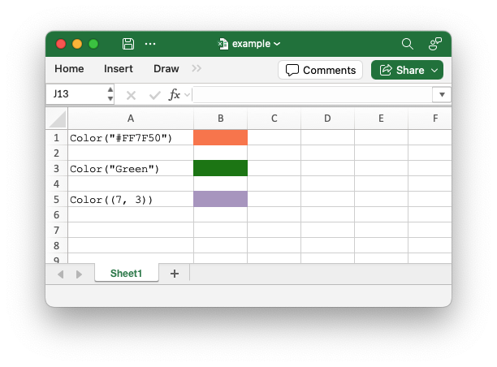
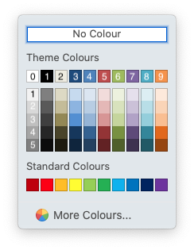

.. SPDX-License-Identifier: BSD-2-Clause
   Copyright (c) 2013-2025, John McNamara, jmcnamara@cpan.org

.. _color:

The Color Class
===============

The ``Color`` class is used to represent Excel color in the XlsxWriter
interface. It can be used to define RGB colors, Named colors and Theme colors::

    from xlsxwriter.color import Color

    # A Color instance using the HTML string constructor.
    color_format = workbook.add_format({"bg_color": Color("#FF7F50")})
    worksheet.write_string(0, 0, 'Color("#FF7F50")')
    worksheet.write_blank(0, 1, None, color_format)

    # A Color instance using a named color string constructor.
    color_format = workbook.add_format({"bg_color": Color("Green")})
    worksheet.write_string(2, 0, 'Color("Green")')
    worksheet.write_blank(2, 1, None, color_format)

    # A Color instance using the Theme tuple constructor.
    color_format = workbook.add_format({"bg_color": Color((7, 3))})
    worksheet.write_string(4, 0, "Color((7, 3))")
    worksheet.write_blank(4, 1, None, color_format)

See also :ref:`colors`.

Constructor
-----------

.. py:function:: Color(color)

   Create a new XlsxWriter Color object.

   :param str|int|tuple(int, int) color: The value of the color. A hex string,
    an integer, or a tuple of two integers.
   :type color: str|int|tuple(int, int)
   :return: A Color object representing the RGB color.
   :rtype: Color

The ``Color`` constructor can be used to create colors in three ways:

1. **String argument**

   A string to represent an RGB color in HTML format ``#RRGGBB``. The range is
   from ``#000000`` (black) to ``#FFFFFF`` (white). A limited number of named
   colors like ``Green``, ``Red``, and ``Blue`` are also supported. These are
   shortcuts for RGB colors. See :func:`rgb()` below for more details.

2. **Integer argument**

   An integer to represent an RGB color in the format
   ``0xRRGGBB``. As with the HTML variant, the range is from ``0x000000`` (black)
   to ``0xFFFFFF`` (white). See the :func:`rgb_integer()` below for more details.

3. **Tuple**

   Theme colors are defined by a tuple of two integers: the first is the theme
   color index (0-9) and the second is the theme shade index (0-5). See the
   :func:`theme()` below for more details.

color.rgb()
-----------

.. py:function:: rgb(color)

   Create a user-defined RGB color from a HTML color string.

   :param color: An RGB value in the range ``#000000`` (black) to ``#FFFFFF``
    (white).
   :type color: str
   :return: A Color object representing the RGB color.
   :rtype: Color

Create a user-defined RGB color from a HTML color string::

    from xlsxwriter.color import Color

    # Create a red color.
    red_color = Color.rgb("#FF0000")

This is an explicit method that is equivalent to the Constructor with a string
value.

XlsxWriter also supports a limited number of named colors. The named colors
are shortcuts for RGB colors::

    from xlsxwriter.color import Color

    # Create a green color.
    green_color = Color.rgb("Green")

The named colors are:

+------------+----------------+
| Color name | RGB color code |
+============+================+
| Black      | ``#000000``    |
+------------+----------------+
| Blue       | ``#0000FF``    |
+------------+----------------+
| Brown      | ``#800000``    |
+------------+----------------+
| Cyan       | ``#00FFFF``    |
+------------+----------------+
| Gray       | ``#808080``    |
+------------+----------------+
| Green      | ``#008000``    |
+------------+----------------+
| Lime       | ``#00FF00``    |
+------------+----------------+
| Magenta    | ``#FF00FF``    |
+------------+----------------+
| Navy       | ``#000080``    |
+------------+----------------+
| Orange     | ``#FF6600``    |
+------------+----------------+
| Pink       | ``#FF00FF``    |
+------------+----------------+
| Purple     | ``#800080``    |
+------------+----------------+
| Red        | ``#FF0000``    |
+------------+----------------+
| Silver     | ``#C0C0C0``    |
+------------+----------------+
| White      | ``#FFFFFF``    |
+------------+----------------+
| Yellow     | ``#FFFF00``    |
+------------+----------------+

color.rgb_integer()
-------------------

.. py:function:: rgb_integer(color)

   Create a user-defined RGB color from an integer.

   :param color: An RGB value in the range 0x000000 (black) to 0xFFFFFF (white).
   :type color: int
   :return: A Color object representing the RGB color.
   :rtype: Color

Create a user-defined RGB color from an integer value::

    from xlsxwriter.color import Color

    # Create a blue color.
    blue_color = Color.rgb(0x00FF00)

This is an explicit method that is equivalent to the Constructor with an integer
value.

color.theme()
-------------

.. py:function:: theme(color, shade)

   Create a theme color.

   :param color: The theme color index (0-9).
   :type color: int
   :param int shade: The theme shade index (0-5).
   :type shade: int
   :return: A Color object representing the theme color.
   :rtype: Color

This is an explicit method that is equivalent to the Constructor with a tuple
value. Theme colors represent the default Excel theme color palette:

The syntax for theme colors is ``(color, shade)`` where ``color`` is one of the
0-9 values on the top row and ``shade`` is the variant in the associated column
from 0-5. For example "White, background 1" in the top left is ``color.theme(0, 0)``
and "Orange, Accent 6, Darker 50%" in the bottom right is ``color.theme(9, 5)``.

