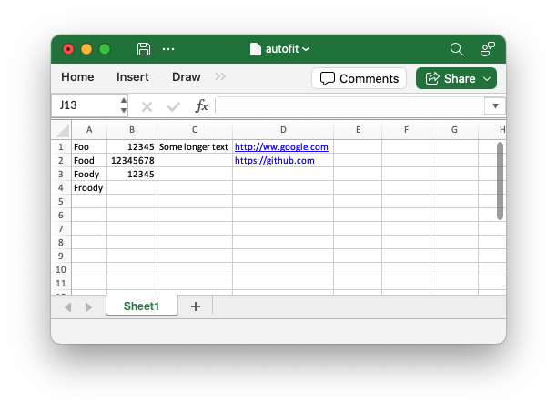

.. SPDX-License-Identifier: BSD-2-Clause
   Copyright (c) 2013-2025, John McNamara, jmcnamara@cpan.org

.. _ex_autofit:

Example: Autofitting columns
============================

An example of simulating autofitting column widths using the  :func:`autofit` method:

.. literalinclude:: ../../../examples/autofit.py

