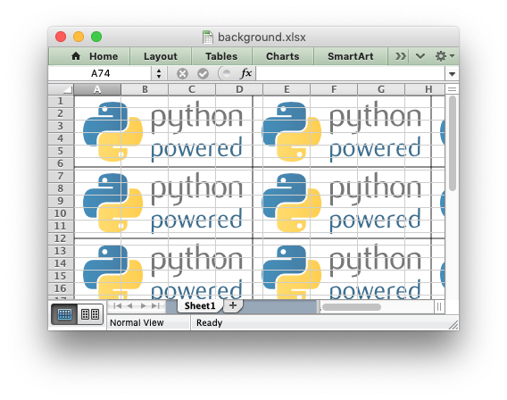

.. SPDX-License-Identifier: BSD-2-Clause
   Copyright 2013-2024, John McNamara, jmcnamara@cpan.org

.. _ex_background:

Example: Setting the Worksheet Background
=========================================

This program is an example of setting a worksheet background image. See the
:func:`set_background` method for more details.

.. literalinclude:: ../../../examples/background.py

