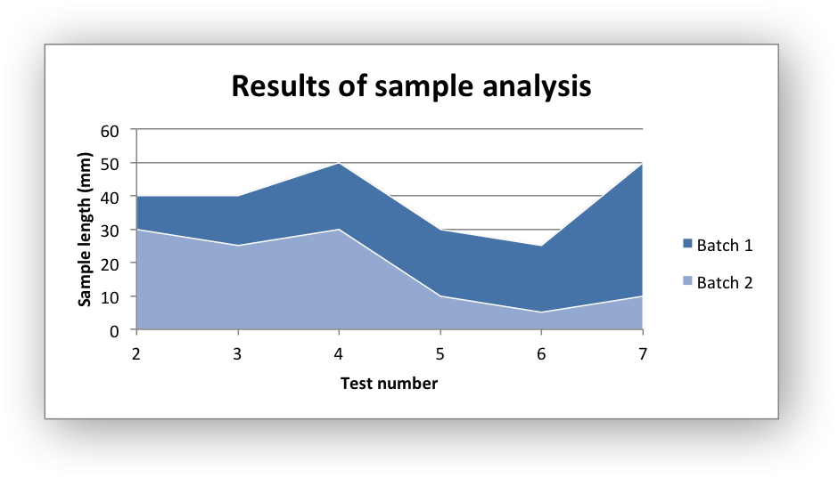
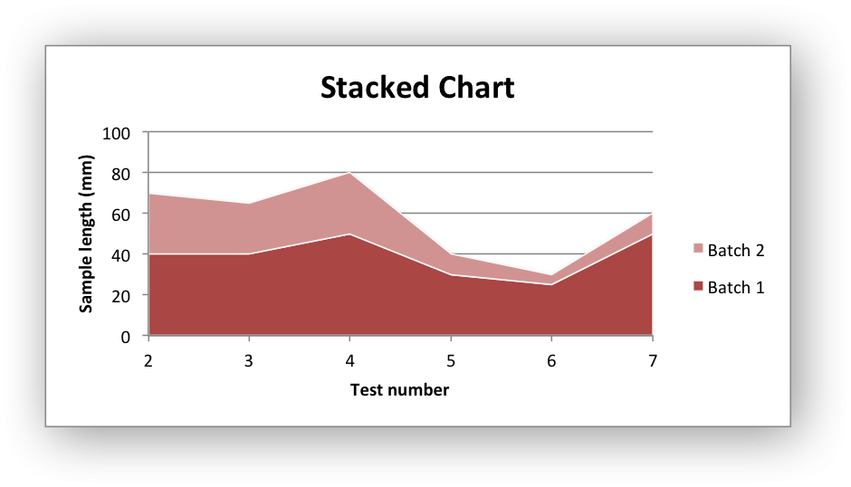
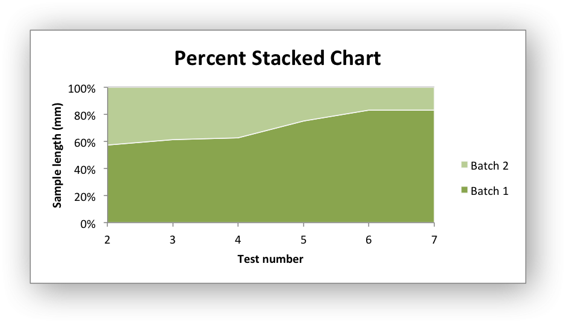

.. _ex_chart_area:

Example: Area Chart
===================

Example of creating Excel Area charts.

Chart 1 in the following example is a default area chart:

Chart 2 is a stacked area chart:

Chart 3 is a percentage stacked area chart:

.. literalinclude:: ../../../examples/chart_area.py
