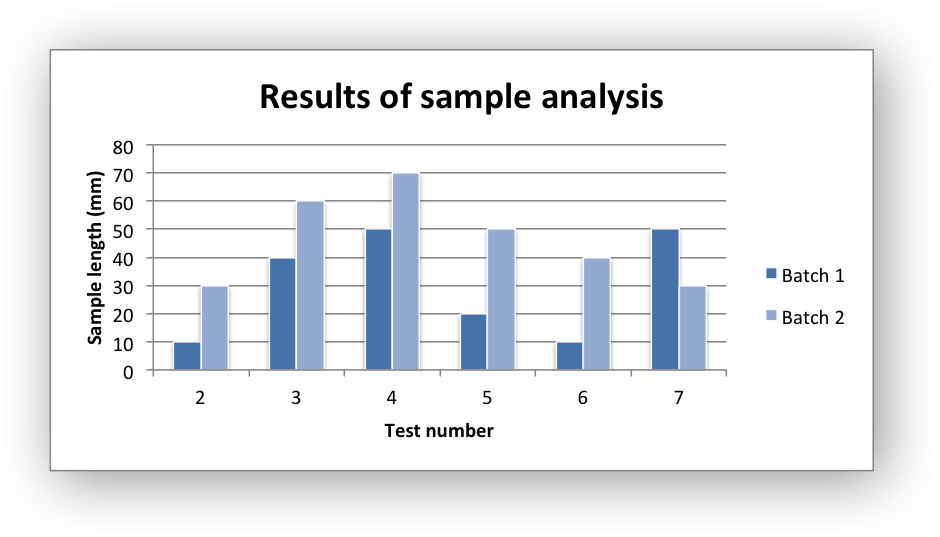
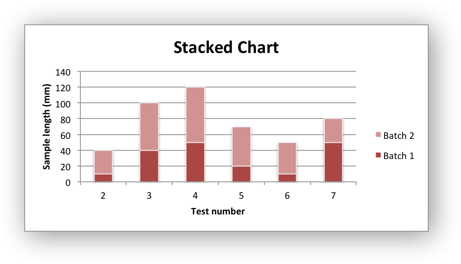

.. _ex_chart_column:

Example: Column Chart
=====================

Example of creating Excel Column charts.

Chart 1 in the following example is a default column chart:

Chart 2 is a stacked column chart:

Chart 3 is a percentage stacked column chart:

.. image:: _images/chart_column3.png
   :scale: 75 %

.. literalinclude:: ../../../examples/chart_column.py
