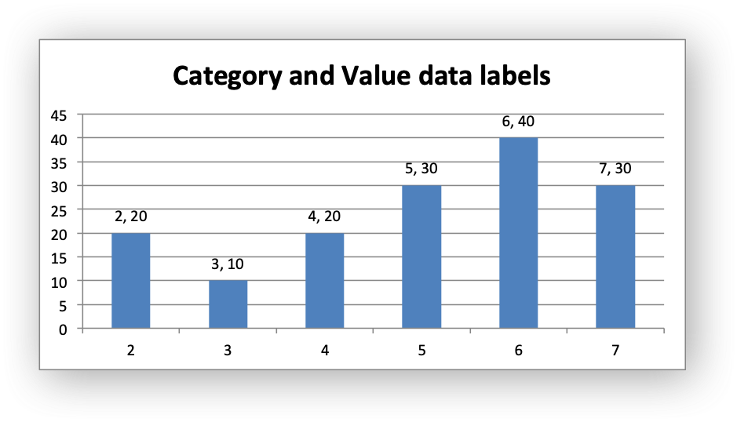
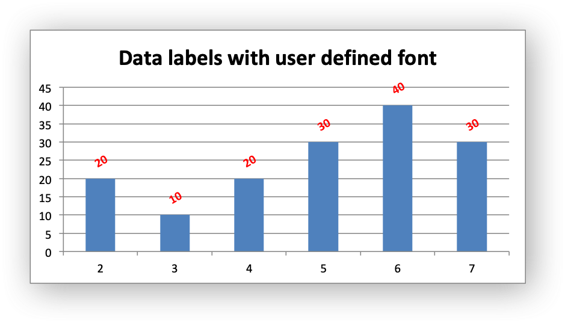
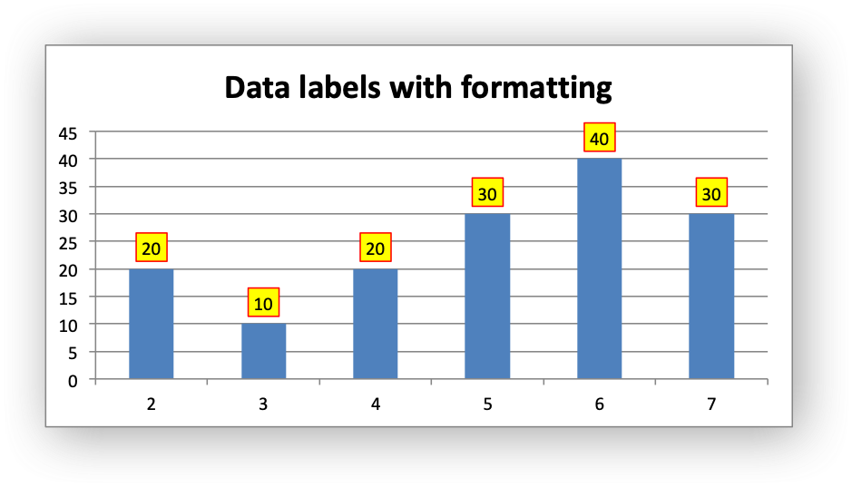
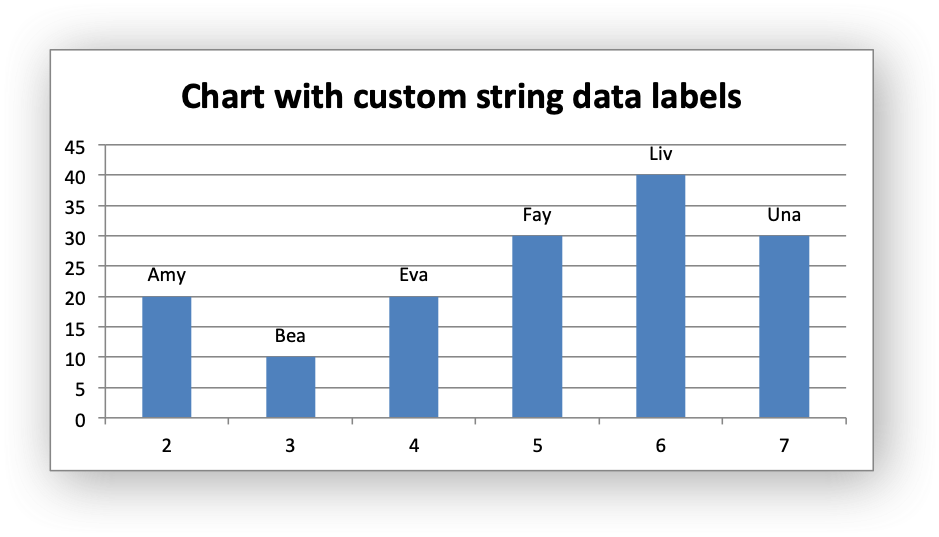
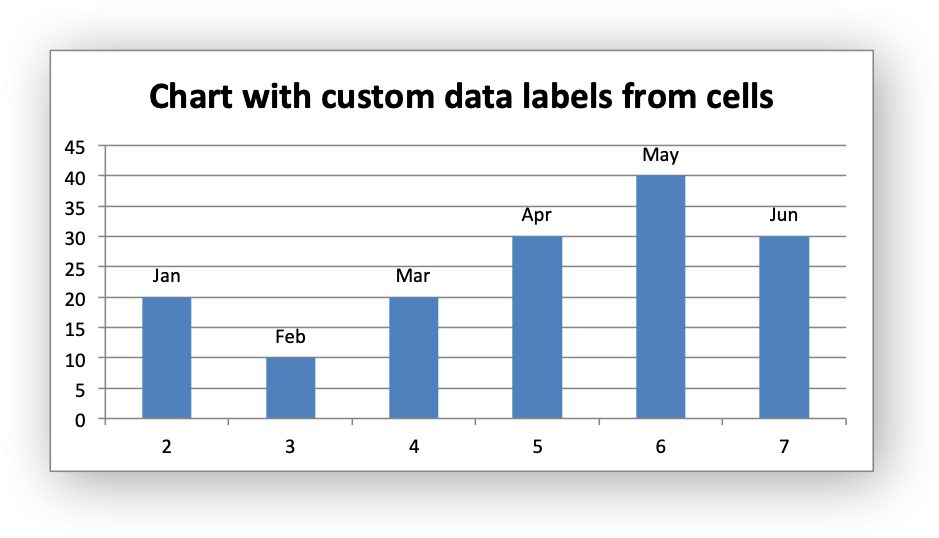
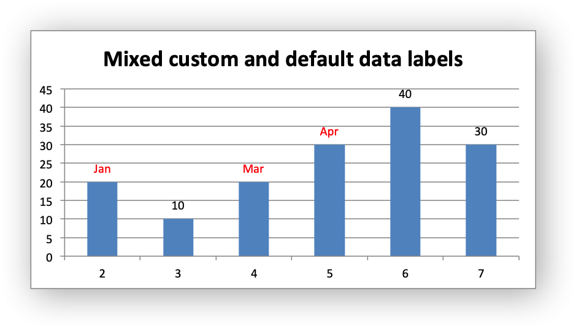
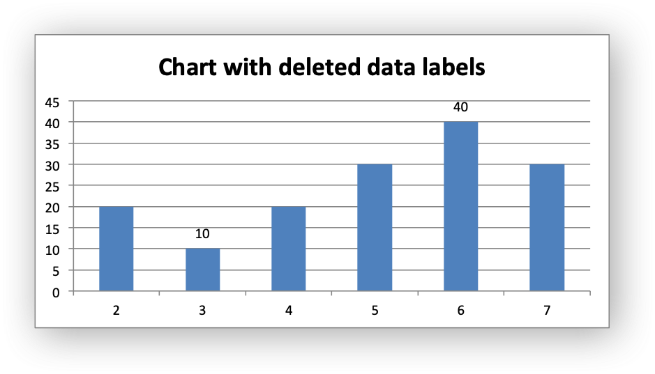
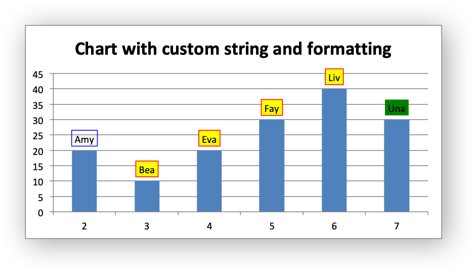

.. SPDX-License-Identifier: BSD-2-Clause
   Copyright 2013-2024, John McNamara, jmcnamara@cpan.org

.. _ex_chart_data_labels:

Example: Charts with Data Labels
================================

A demo of some of the Excel chart data labels options that are available via
an XlsxWriter chart. These include custom labels with user text or text taken
from cells in the worksheet. See also :ref:`chart_series_option_data_labels`
and :ref:`chart_series_option_custom_data_labels`.

Chart 1 in the following example is a chart with standard data labels:

.. image:: _images/chart_data_labels11.png
   :scale: 75 %

Chart 2 is a chart with Category and Value data labels:

Chart 3 is a chart with data labels with a user defined font:

Chart 4 is a chart with standard data labels and formatting:

Chart 5 is a chart with custom string data labels:

Chart 6 is a chart with custom data labels referenced from worksheet cells:

Chart 7 is a chart with a mix of custom and default labels. The ``None`` items
will get the default value. We also set a font for the custom items as an
extra example:

Chart 8 is a chart with some deleted custom labels and defaults (set with
``None`` values). This allows us to highlight certain values such as the
minimum and maximum:

Chart 9 is a chart with custom string data labels and formatting:

.. literalinclude:: ../../../examples/chart_data_labels.py
