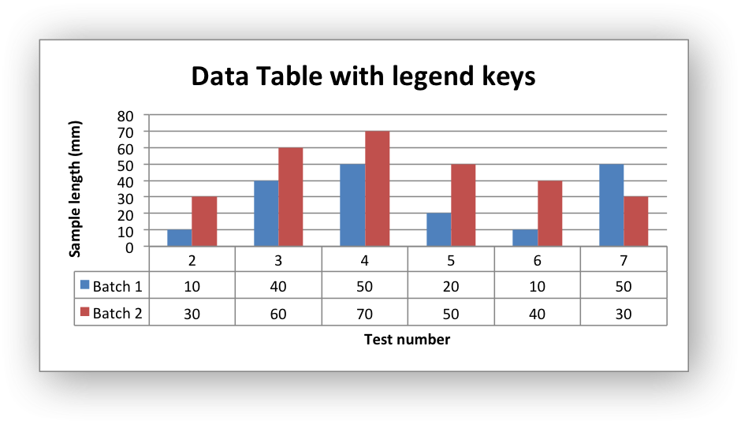

.. _ex_chart_data_table:

Example: Charts with Data Tables
================================

Example of creating charts with data tables.

Chart 1 in the following example is a column chart with default data table:

.. image:: _images/chart_data_table1.png
   :scale: 75 %

Chart 2 is a column chart with default data table with legend keys:

.. literalinclude:: ../../../examples/chart_data_table.py
