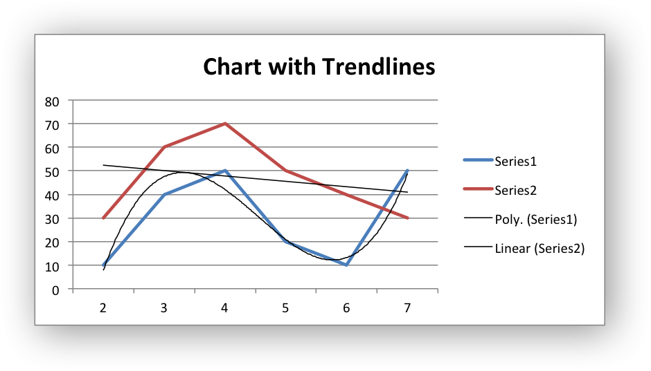
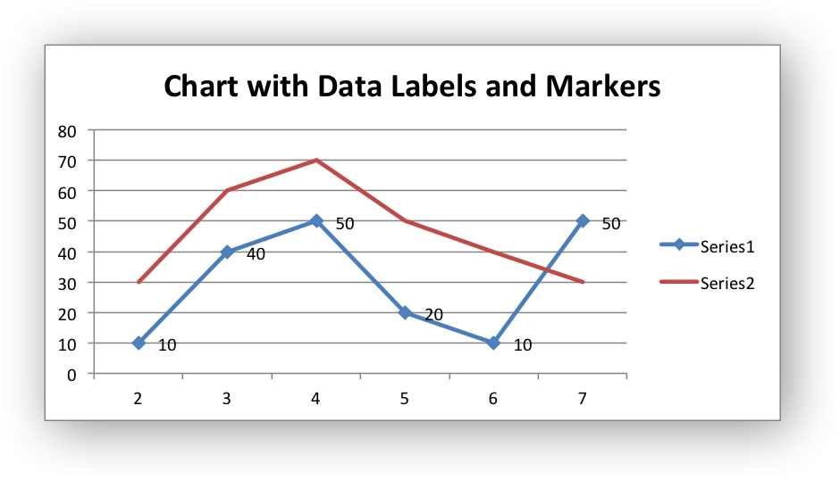
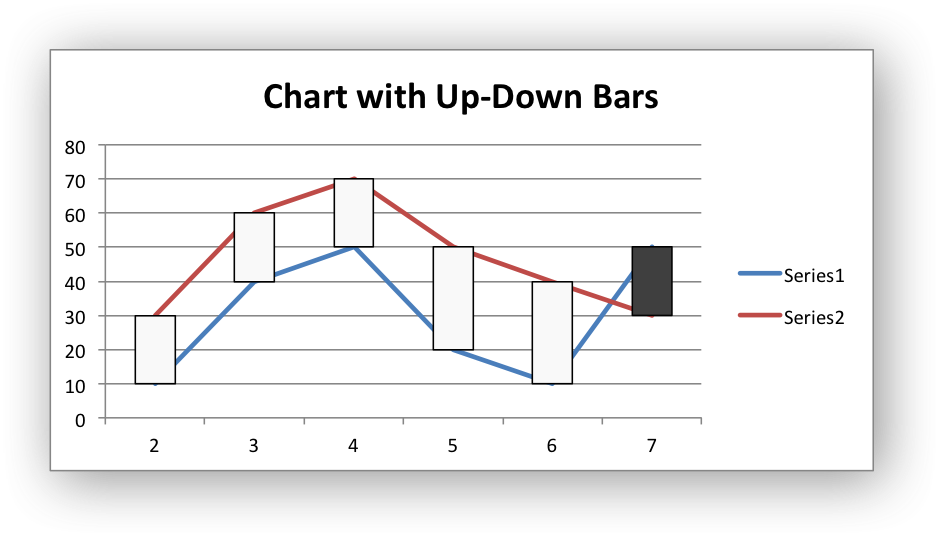
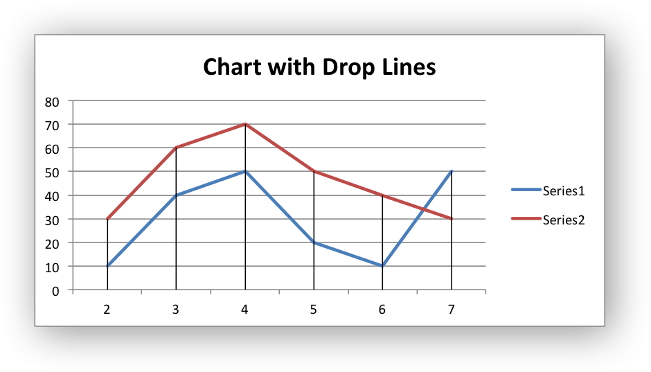

.. _ex_chart_data_tools:

Example: Charts with Data Tools
===============================

A demo of an various Excel chart data tools that are available via an
XlsxWriter chart. These include, Trendlines, Data Labels, Error Bars, Drop
Lines, High-Low Lines and Up-Down Bars.

Chart 1 in the following example is a chart with trendlines:

Chart 2 is a chart with data labels and markers:

Chart 3 is a chart with error bars:

.. image:: _images/chart_data_tools3.png
   :scale: 75 %

Chart 4 is a chart with up-down bars:

Chart 5 is a chart with hi-low lines:

.. image:: _images/chart_data_tools5.png
   :scale: 75 %

Chart 6 is a chart with drop lines:

.. literalinclude:: ../../../examples/chart_data_tools.py
