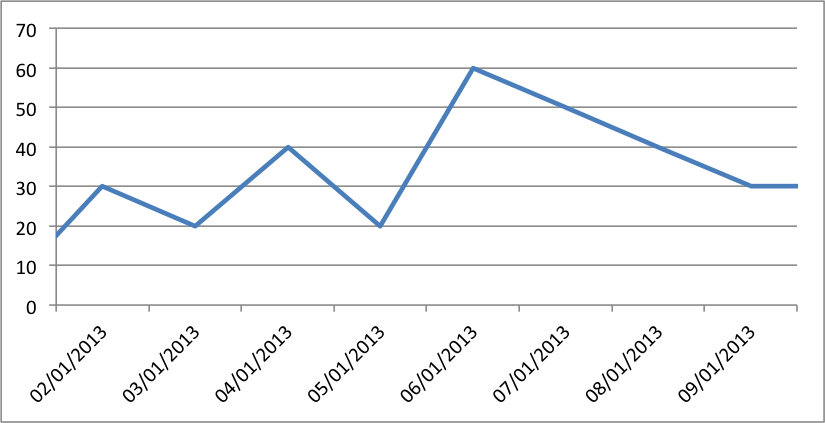

.. _ex_chart_date_axis:

Example: Date Axis Chart
========================

Date Category Axes are a special case of Category axes in Excel which give them
some of the properties of Values axes.

For example, Excel doesn't normally allow minimum and maximum values to be set
for category axes. However, date axes are an exception.

In XlsxWriter Date Category Axes are set using the ``date_axis`` option in
:func:`set_x_axis` or :func:`set_y_axis`:: 

    chart.set_x_axis({'date_axis': True})

If used, the ``min`` and ``max`` values should be set as Excel times or dates.

.. literalinclude:: ../../../examples/chart_date_axis.py
