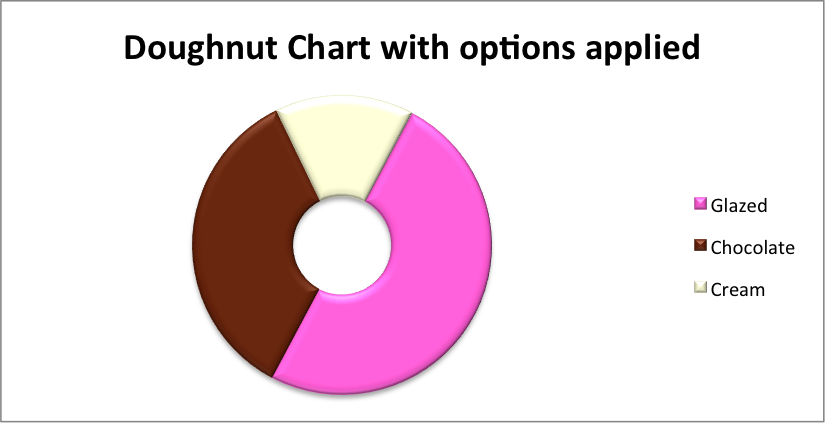

.. _ex_chart_doughnut:

Example: Doughnut Chart
=======================

Example of creating Excel Doughnut charts. Chart 1 in the following example is:

.. image:: _images/chart_doughnut1.png
   :scale: 75 %

Chart 4 shows how to set segment colors and other options.

It is possible to define chart colors for most types of XlsxWriter charts via
the :func:`add_series()` method. However, Pie/Doughnut charts are a special
case since each segment is represented as a point and as such it is necessary
to assign formatting to each point in the series.

.. literalinclude:: ../../../examples/chart_doughnut.py
