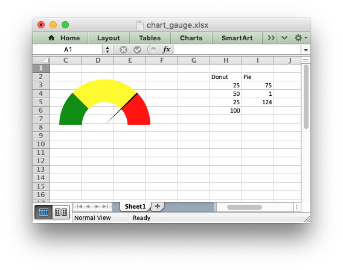

.. SPDX-License-Identifier: BSD-2-Clause
   Copyright 2013-2023, John McNamara, jmcnamara@cpan.org

.. _ex_chart_gauge:

Example: Gauge Chart
====================

A Gauge Chart isn't a native chart type in Excel. It is constructed by
combining a doughnut chart and a pie chart and by using some non-filled
elements. This example follows the following online example of how to create a
Gauge Chart in Excel: https://www.excel-easy.com/examples/gauge-chart.html

.. literalinclude:: ../../../examples/chart_gauge.py
