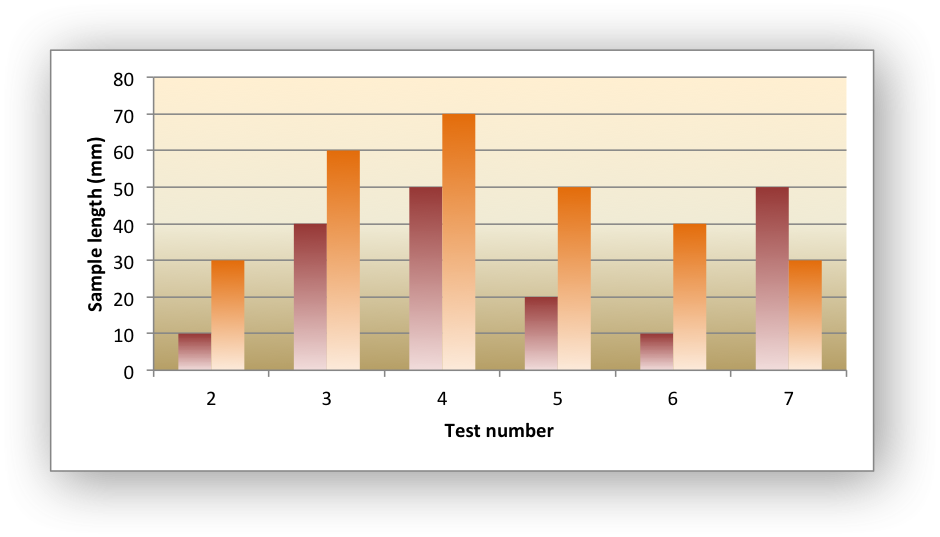

.. _ex_chart_gradient:

Example: Chart with Gradient Fills
==================================

Example of creating an Excel chart with gradient fills, in the columns and
in the plot area.

.. literalinclude:: ../../../examples/chart_gradient.py
