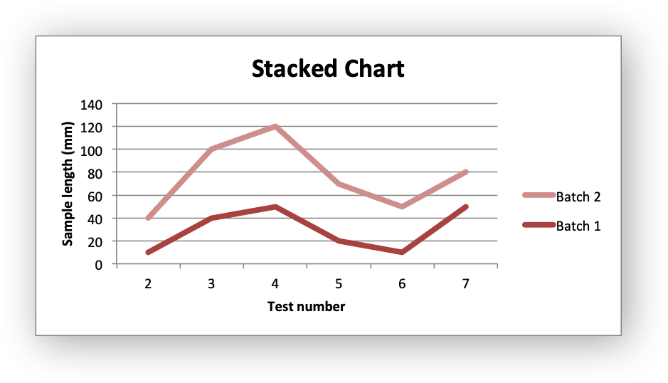
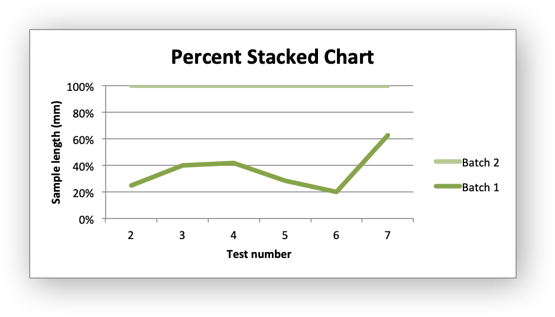

.. SPDX-License-Identifier: BSD-2-Clause
   Copyright 2013-2023, John McNamara, jmcnamara@cpan.org

.. _ex_chart_line:

Example: Line Chart
===================

Example of creating an Excel line charts. The X axis of a line chart is a
category axis with fixed point spacing. For a line chart with arbitrary point
spacing see the Scatter chart type.

Chart 1 in the following example is a default line chart:

.. image:: _images/chart_line1.png
   :scale: 75 %

Chart 2 is a stacked line chart:

Chart 3 is a percentage stacked line chart:

.. literalinclude:: ../../../examples/chart_line.py
