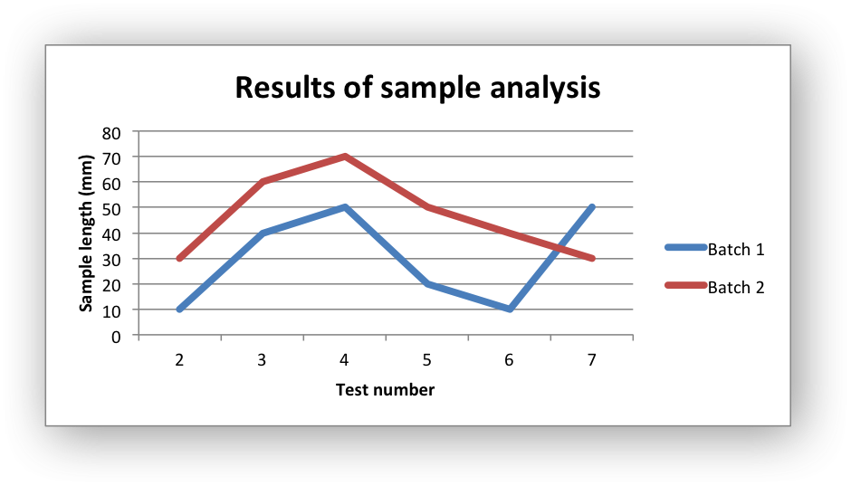

.. _ex_chart_line:

Example: Line Chart
===================

Example of creating an Excel line chart. The X axis of a line chart is a
category axis with fixed point spacing. For a line chart with arbitrary point
spacing see the Scatter chart type.

Chart 1 in the following example is:

.. literalinclude:: ../../../examples/chart_line.py
