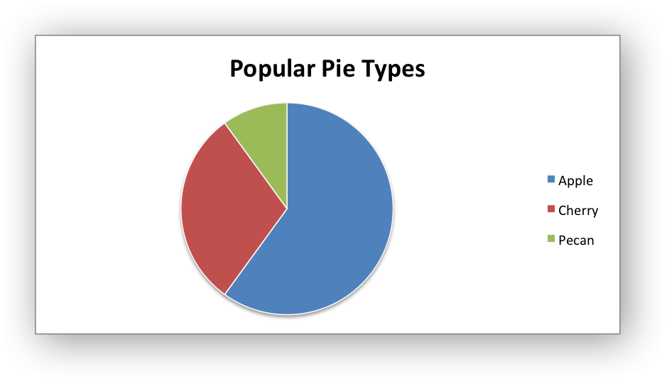
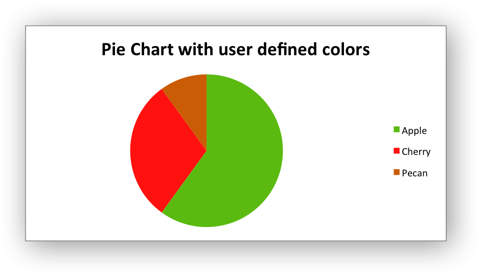
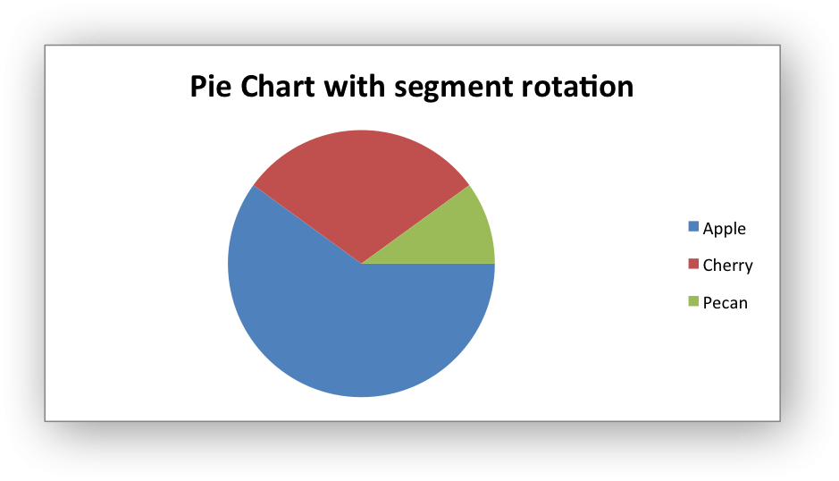

.. _ex_chart_pie:

Example: Pie Chart
==================

Example of creating Excel Pie charts. Chart 1 in the following example is:

Chart 2 shows how to set segment colors.

It is possible to define chart colors for most types of XlsxWriter charts via
the :func:`add_series()` method. However, Pie charts are a special case since
each segment is represented as a point and as such it is necessary to assign
formatting to each point in the series.

Chart 3 shows how to rotate the segments of the chart:

.. literalinclude:: ../../../examples/chart_pie.py
