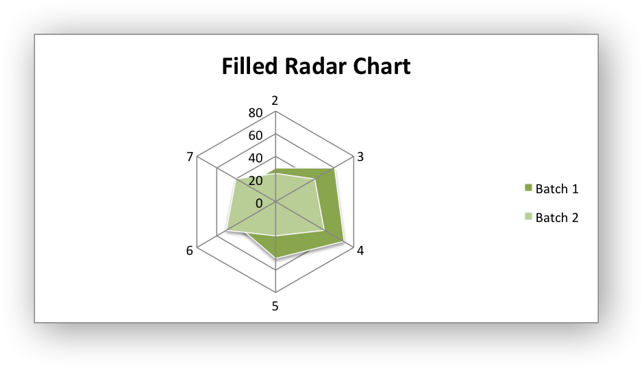

.. _ex_chart_radar:

Example: Radar Chart
====================

Example of creating Excel Column charts.

Chart 1 in the following example is a default radar chart:

.. image:: _images/chart_radar1.png
   :scale: 75 %

Chart 2 in the following example is a radar chart with markers:

.. image:: _images/chart_radar2.png
   :scale: 75 %

Chart 3 in the following example is a filled radar chart:

.. literalinclude:: ../../../examples/chart_radar.py
