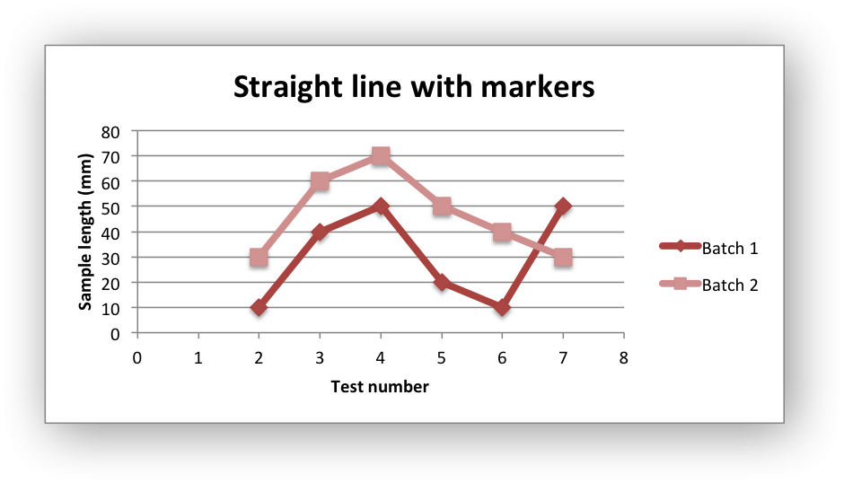
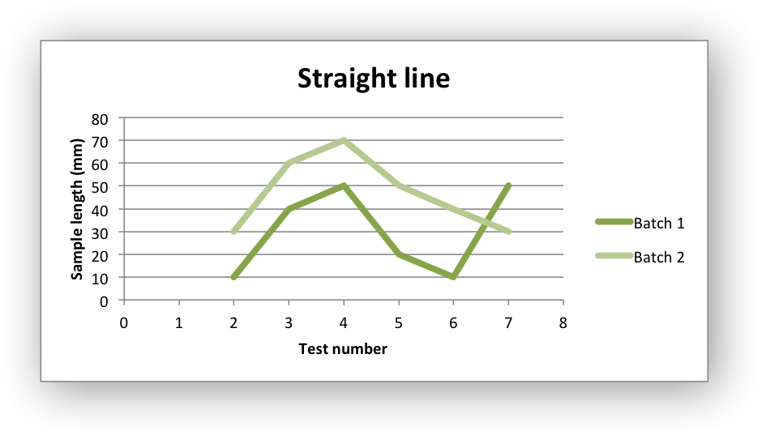
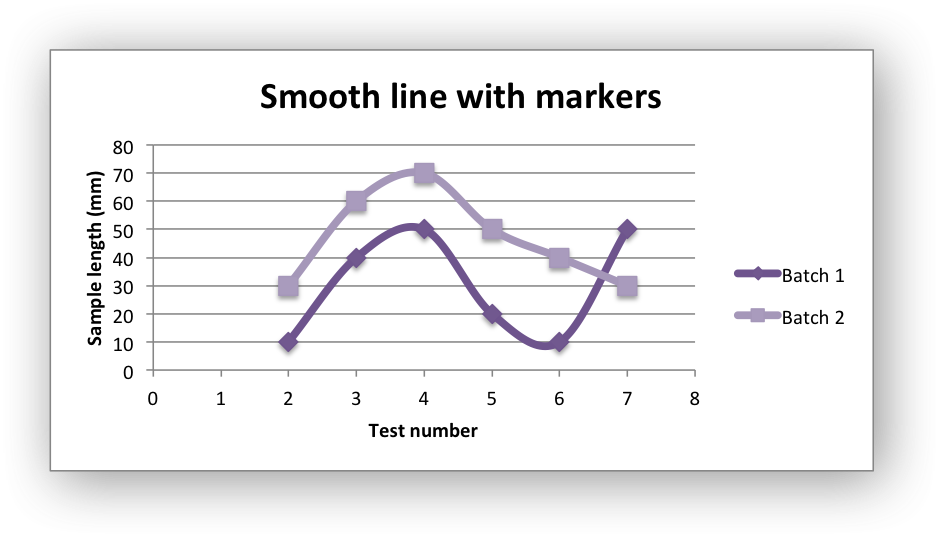

.. _ex_chart_scatter:

Example: Scatter Chart
======================

Example of creating Excel Scatter charts.

Chart 1 in the following example is a default scatter chart:

.. image:: _images/chart_scatter1.png
   :scale: 75 %

Chart 2 is a scatter chart with straight lines and markers:

Chart 3 is a scatter chart with straight lines and no markers:

Chart 4 is a scatter chart with smooth lines and markers:

Chart 5 is a scatter chart with smooth lines and no markers:

.. image:: _images/chart_scatter5.png
   :scale: 75 %

.. literalinclude:: ../../../examples/chart_scatter.py
