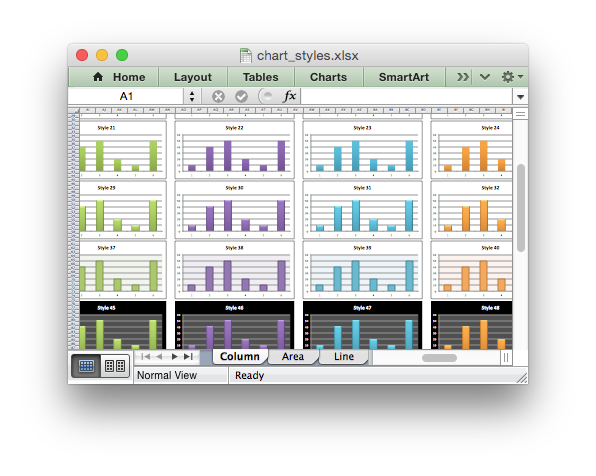

.. SPDX-License-Identifier: BSD-2-Clause
   Copyright 2013-2023, John McNamara, jmcnamara@cpan.org

.. _ex_chart_styles:

Example: Styles Chart
=====================

An example showing all 48 default chart styles available in Excel 2007 using
the chart :func:`set_style()` method.

Note, these styles are not the same as the styles available in Excel 2013.

.. literalinclude:: ../../../examples/chart_styles.py
