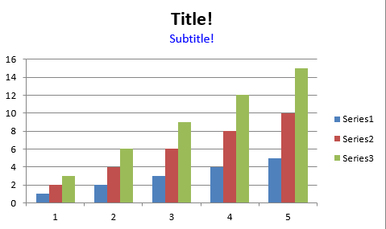

.. SPDX-License-Identifier: BSD-2-Clause
   Copyright 2013-2023, John McNamara, jmcnamara@cpan.org

.. _ex_chart_simple:

Example: Chart with title and subtitle
=======================

Example of a simple chart with a subtitle:

See the :ref:`chart_class` and :ref:`working_with_charts` for more details.

.. literalinclude:: ../../../examples/chart_subtitle.py
