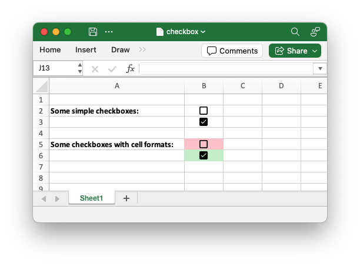

.. SPDX-License-Identifier: BSD-2-Clause
   Copyright (c) 2013-2025, John McNamara, jmcnamara@cpan.org

.. _ex_checkbox:

Example: Inserting a checkbox in a Worksheet
============================================

An example of adding checkbox boolean values to a worksheet.

.. literalinclude:: ../../../examples/checkbox.py
