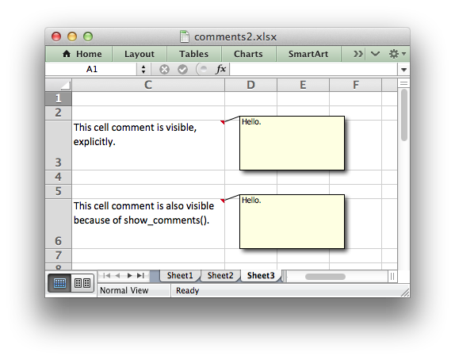

.. _ex_comments2:

Example: Adding Cell Comments to Worksheets (Advanced)
======================================================

Another example of adding cell comments to a worksheet. This example
demonstrates most of the available comment formatting options. For more
details see :ref:`cell_comments`.

Code:

.. literalinclude:: ../../../examples/comments2.py
