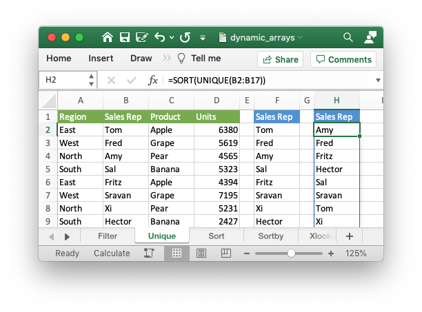

.. _ex_dynamic_arrays:

Example: Dynamic array formulas
===============================

This program is an example of writing formulas that work with dynamic arrays
using some of the new functions and functionality introduced in Excel 365. See
the :func:`write_dynamic_array_formula` method and
:ref:`formula_dynamic_arrays` for more details.

.. literalinclude:: ../../../examples/dynamic_arrays.py

