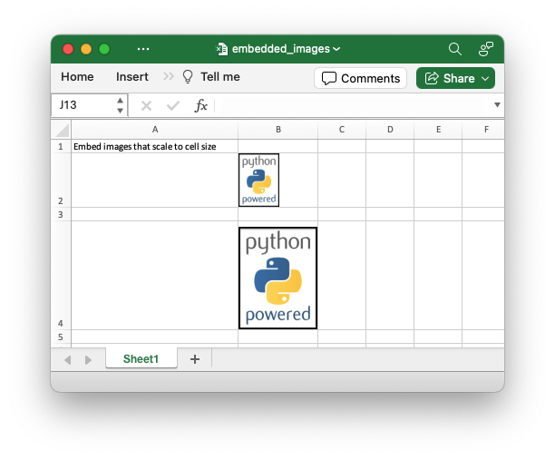

.. SPDX-License-Identifier: BSD-2-Clause
   Copyright 2013-2023, John McNamara, jmcnamara@cpan.org

.. _ex_embedded_images:

Example: Embedding images into a worksheet
==========================================

This program is an example of embedding images into a worksheet. This is
equivalent to Excel's "Place in cell" image insert. The image will scale
automatically to fit the cell.

See the
:func:`embed_image` method for more details.

.. literalinclude:: ../../../examples/embedded_images.py

