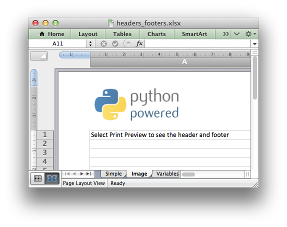

.. _ex_headers_footers:

Example: Adding Headers and Footers to Worksheets
=================================================

This program is an example of adding headers and footers to worksheets.
See the :func:`set_header` and :func:`set_footer` methods for more details.

.. literalinclude:: ../../../examples/headers_footers.py

