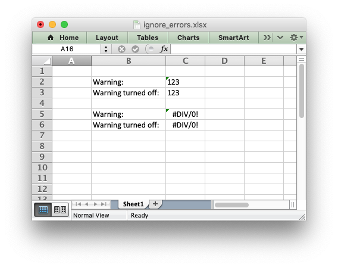

.. SPDX-License-Identifier: BSD-2-Clause
   Copyright (c) 2013-2025, John McNamara, jmcnamara@cpan.org

.. _ex_ignore_errors:

Example: Ignoring Worksheet errors and warnings
===============================================

An example of ignoring Excel worksheet errors/warnings using the worksheet
:func:`ignore_errors()` method.

.. literalinclude:: ../../../examples/ignore_errors.py
