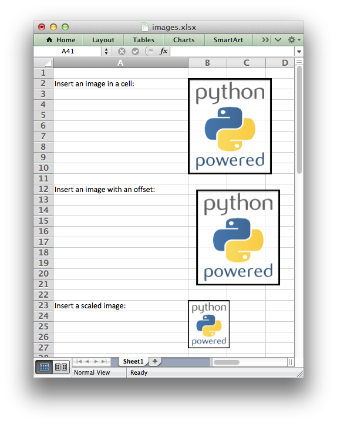

.. SPDX-License-Identifier: BSD-2-Clause
   Copyright 2013-2021, John McNamara, jmcnamara@cpan.org

.. _ex_insert_image:

Example: Inserting images into a worksheet
==========================================

This program is an example of inserting images into a worksheet. See the
:func:`insert_image` method for more details.

.. literalinclude:: ../../../examples/images.py

