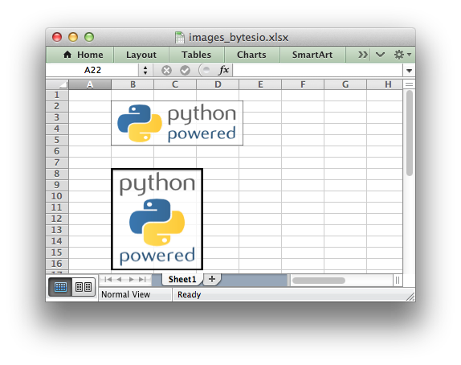

.. _ex_images_bytesio:

Example: Inserting images from a URL or byte stream into a worksheet
====================================================================

This program is an example of inserting images from a Python
:class:`io.BytesIO` byte stream into a worksheet.

The example byte streams are populated from a URL and from a local file.

See the :func:`insert_image` method for more details.

.. literalinclude:: ../../../examples/images_bytesio.py

