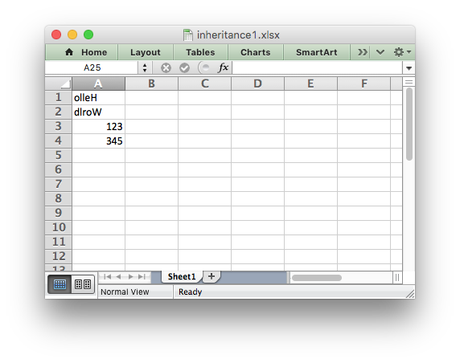

.. _ex_inheritance1:

Example: Example of subclassing the Workbook and Worksheet classes
==================================================================

Example of how to subclass the Workbook and Worksheet objects.

We also override the default ``worksheet.write()`` method to show how that is
done.

.. literalinclude:: ../../../examples/inheritance1.py
