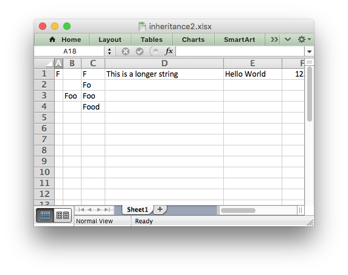

.. _ex_inheritance2:

Example: Advanced example of subclassing
========================================

Example of how to subclass the Workbook and Worksheet objects. See also the
simpler :ref:`inheritance1.py <ex_inheritance1>` example.

In this example we see an approach to implementing a simulated autofit in a
user application. This works by overriding the ``write_string()`` method to
track the maximum width string in each column and then set the column widths
when closing the workbook.

Some notes on this:

* **This isn't a fully functional autofit example** (as shown by the longer
  strings in the screen shot). It is only a proof or concept or a framework to
  try out solutions.

* The hard part is coming up with an accurate (or mainly accurate)
  ``excel_string_width()`` function. One possibility is to use the PIL
  `ImageFont()
  <http://pillow.readthedocs.io/en/latest/reference/ImageFont.html>`_ method
  and convert the pixel width back to a character width.

* A more rigorous approach would have to consider font sizes, bold, italic,
  etc.
* The ``set_column()`` calls in ``close()`` will override any others set by the
  user. They also don't set any column formats.
* It doesn't work for horizontal merge ranges.
* There are probably some other corner cases hiding here.

.. literalinclude:: ../../../examples/inheritance2.py
