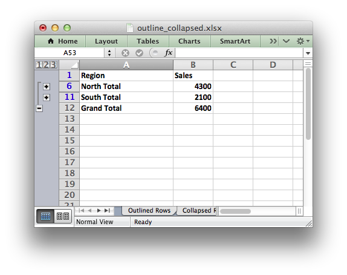

.. _ex_outline2:

Example: Collapsed Outline and Grouping
=======================================

Examples of how use XlsxWriter to generate Excel outlines and
grouping. These examples focus mainly on collapsed outlines. See also
:ref:`outlines`.

.. literalinclude:: ../../../examples/outline_collapsed.py
