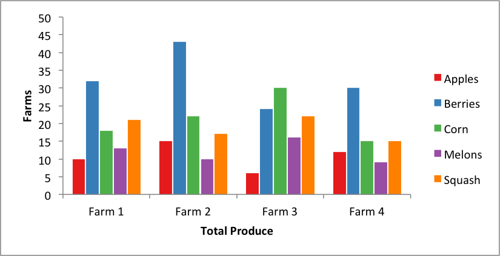

.. _ex_pandas_chart_columns:

Example: Pandas Excel output with a column chart
================================================

An example of converting a Pandas dataframe to an Excel file with a column
chart using Pandas and XlsxWriter.

.. literalinclude:: ../../../examples/pandas_chart_columns.py
