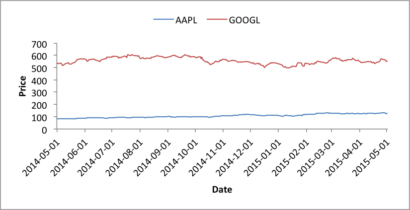

.. _ex_pandas_chart_stock:

Example: Pandas Excel output with a stock chart
===============================================

An example of converting a Pandas dataframe with stock data taken from the web
to an Excel file with a line chart using Pandas and XlsxWriter.

Note: occasionally the Yahoo source for the data used in the chart is down or
under maintenance. If there are any issues running this program check the
source data first.

.. literalinclude:: ../../../examples/pandas_chart_stock.py
