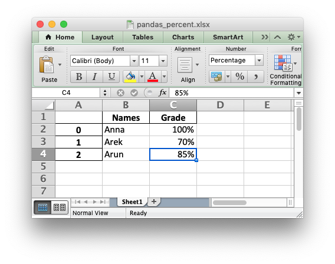

.. SPDX-License-Identifier: BSD-2-Clause
   Copyright 2013-2024, John McNamara, jmcnamara@cpan.org

.. _ex_pandas_percentage:

Example: Pandas Excel output with percentage formatting
=======================================================

To create a percentage in Excel the data must be a number, must be divided by
100 and must have a percentage number format applied.

Here is a simple example of converting some string percentage data in a Pandas
dataframe to percentage numbers in an xlsx file using XlsxWriter as the Pandas
excel engine:

.. literalinclude:: ../../../examples/pandas_percentage.py
