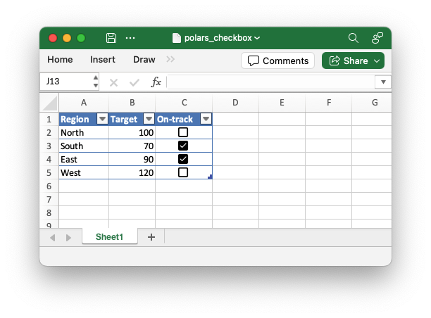

.. SPDX-License-Identifier: BSD-2-Clause
   Copyright (c) 2013-2025, John McNamara, jmcnamara@cpan.org

.. _ex_polars_checkbox:

Example: Polars Excel output with a boolean checkboxes
======================================================

A example of displaying the boolean values in a Polars dataframe as checkboxes
in an output xlsx file.

.. literalinclude:: ../../../examples/polars_checkbox.py
