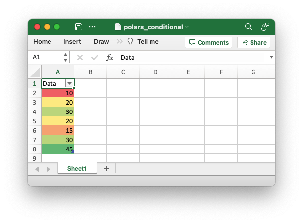

.. SPDX-License-Identifier: BSD-2-Clause
   Copyright 2013-2023, John McNamara, jmcnamara@cpan.org

.. _ex_polars_conditional:

Example: Polars Excel output with conditional formatting
========================================================

An example of adding a dataframe with conditional formatting to a worksheet
using Polars and XlsxWriter. See :ref:`ewx_polars` for more details.

.. literalinclude:: ../../../examples/polars_conditional_format.py
