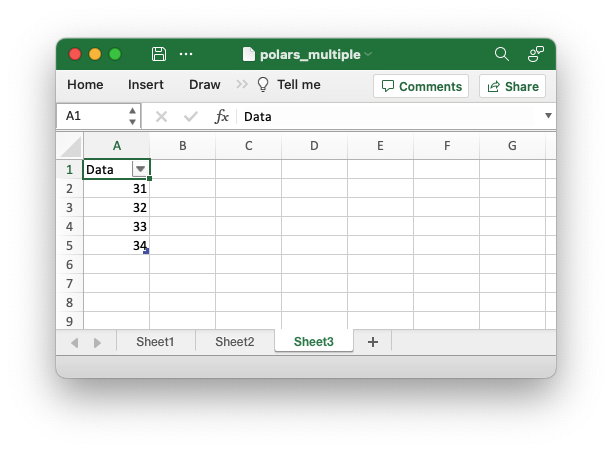

.. SPDX-License-Identifier: BSD-2-Clause
   Copyright 2013-2023, John McNamara, jmcnamara@cpan.org

.. _ex_polars_multiple:

Example: Polars Excel with multiple dataframes
==============================================

An example of writing multiple dataframes to worksheets using Polars and
XlsxWriter. See :ref:`ewx_polars` for more details.

.. literalinclude:: ../../../examples/polars_multiple.py
