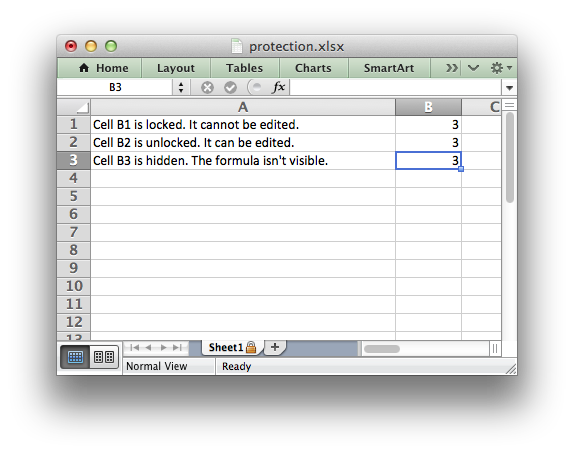

.. _ex_protection:

Example: Enabling Cell protection in Worksheets
===============================================

This program is an example cell locking and formula hiding in an Excel
worksheet using the :func:`protect` worksheet method.

.. literalinclude:: ../../../examples/worksheet_protection.py

