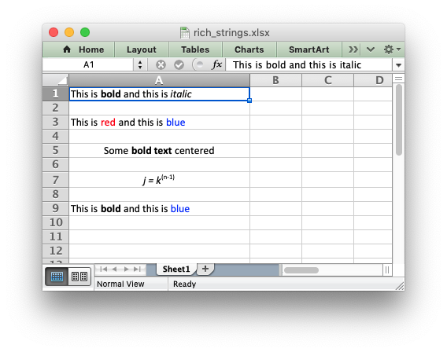

.. _ex_rich_strings:

Example: Writing "Rich" strings with multiple formats
=====================================================

This program is an example of writing rich stings with multiple format to a
cell in a worksheet. See the :func:`write_rich_string` method for more details.

.. literalinclude:: ../../../examples/rich_strings.py

