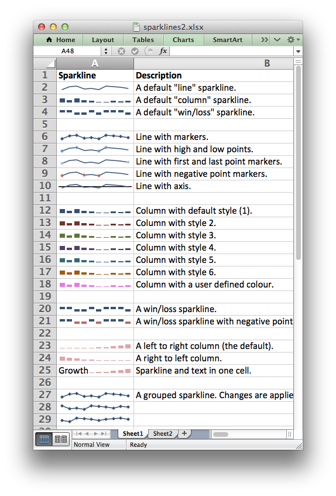

.. _ex_sparklines2:

Example: Sparklines (Advanced)
==============================

This example shows the majority of options that can be applied to sparklines.

Sparklines are small charts that fit in a single cell and are used to show
trends in data.

See the :ref:`sparklines` method for more details.

.. literalinclude:: ../../../examples/sparklines2.py

