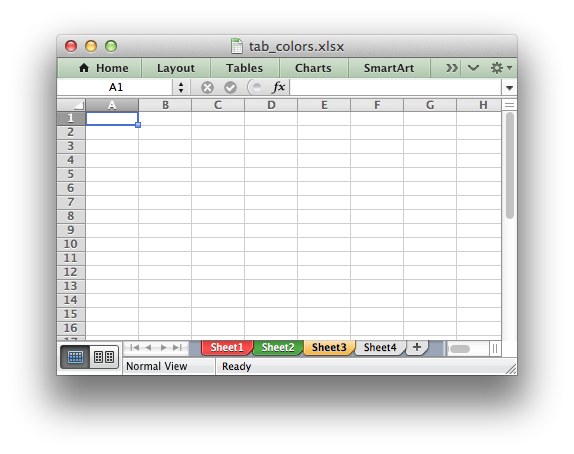

.. _ex_tab_colors:

Example: Setting Worksheet Tab Colors
=====================================

This program is an example of setting worksheet tab colors. See the
:func:`set_tab_color` method for more details.

.. literalinclude:: ../../../examples/tab_colors.py

