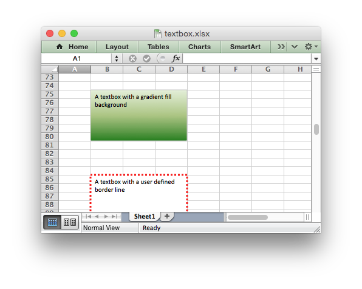

.. SPDX-License-Identifier: BSD-2-Clause
   Copyright 2013-2024, John McNamara, jmcnamara@cpan.org

.. _ex_textbox:

Example: Insert Textboxes into a Worksheet
==========================================

The following is an example of how to insert and format textboxes in a
worksheet, see :func:`insert_textbox()` and :ref:`working_with_textboxes` for
more details.

.. literalinclude:: ../../../examples/textbox.py
