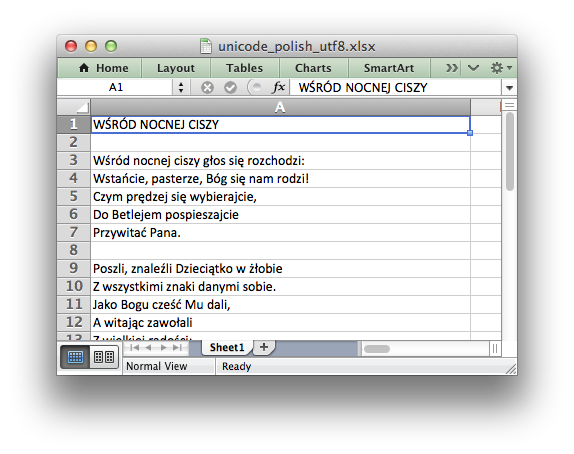

.. _ex_unicode_polish_utf8:

Example: Unicode - Polish in UTF-8
==================================

This program is an example of reading in data from a UTF-8 encoded text file
and converting it to a worksheet.

The main trick is to ensure that the data read in is converted to UTF-8
within the Python program. The XlsxWriter module will then take care of
writing the encoding to the Excel file.

The encoding of the input data shouldn't matter once it can be converted
to UTF-8 via the :mod:`codecs` module.

.. literalinclude:: ../../../examples/unicode_polish_utf8.py

