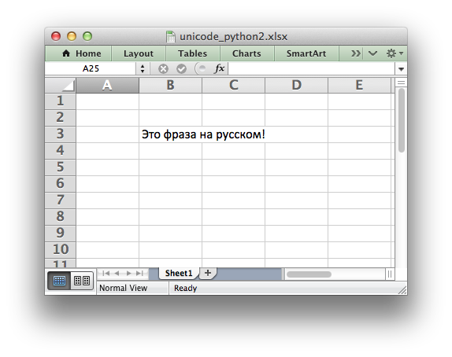

.. _ex_unicode_python2:

Example: Simple Unicode with Python 2
=====================================

To write Unicode text in UTF-8 to a xlsxwriter file in Python 2:

#. Encode the file as UTF-8.
#. Include a "coding" directive at the start of the file.
#. Use ``u''`` to indicate a Unicode string.

.. only:: html

   .. literalinclude:: ../../../examples/unicode_python2.py

