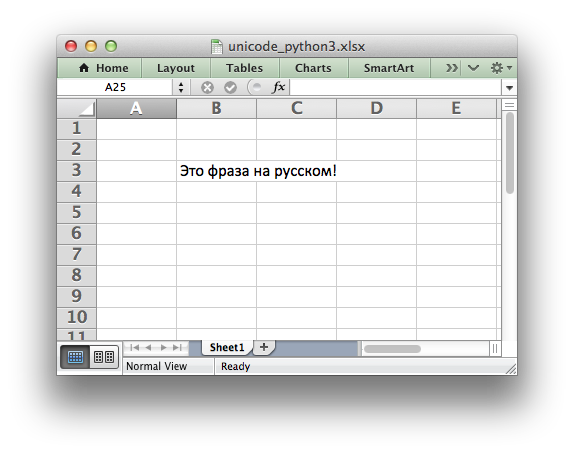

.. _ex_unicode_python3:

Example: Simple Unicode with Python 3
=====================================

To write Unicode text in UTF-8 to a xlsxwriter file in Python 3:

#. Encode the file as UTF-8.

.. only:: html

   .. literalinclude:: ../../../examples/unicode_python3.py

