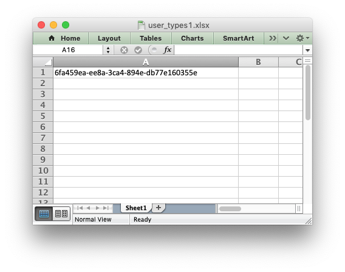

.. SPDX-License-Identifier: BSD-2-Clause
   Copyright 2013-2021, John McNamara, jmcnamara@cpan.org

.. _ex_user_type1:

Example: Writing User Defined Types (1)
=======================================

An example of adding support for user defined types to the XlsxWriter
:func:`write()` method using the :func:`add_write_handler` method.

This example takes UUID data and writes it as a string by adding a callback
handler to the ``write()`` method. A UUID data type would normally raise a
``TypeError`` in XlsxWriter since it isn't a type that is supported by Excel.

See the :ref:`writing_user_types` section for more details on how this
functionality works.

.. literalinclude:: ../../../examples/user_types1.py
