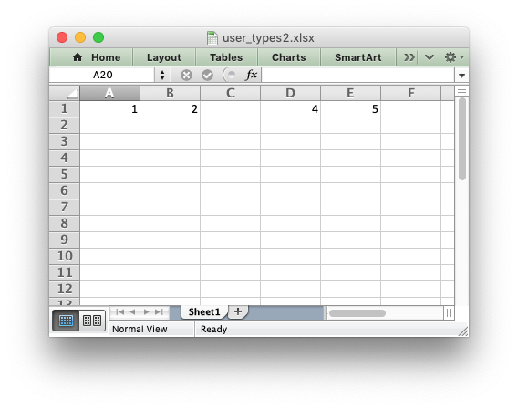

.. SPDX-License-Identifier: BSD-2-Clause
   Copyright 2013-2023, John McNamara, jmcnamara@cpan.org

.. _ex_user_type2:

Example: Writing User Defined Types (2)
=======================================

An example of adding support for user defined types to the XlsxWriter
:func:`write()` method using the :func:`add_write_handler` method.

This example removes ``NaN`` (Not a Number) values from numeric data and
writes a blank cell instead. Note, another way to handle this is with the
``nan_inf_to_errors`` option in the :func:`Workbook` constructor.

See the :ref:`writing_user_types` section for more details on how this
functionality works.

.. literalinclude:: ../../../examples/user_types2.py
