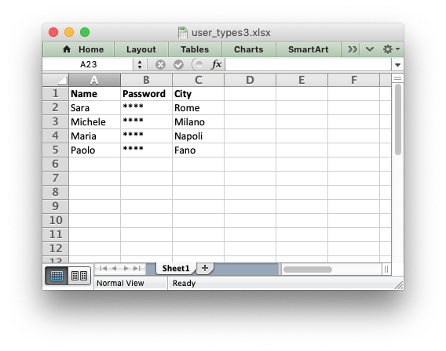

.. SPDX-License-Identifier: BSD-2-Clause
   Copyright 2013-2024, John McNamara, jmcnamara@cpan.org

.. _ex_user_type3:

Example: Writing User Defined types (3)
=======================================

An example of adding support for user defined types to the XlsxWriter
:func:`write()` method using the :func:`add_write_handler` method.

This, somewhat artificial, example shows how to use the ``row`` and ``col``
parameters to control the logic of the callback function. It changes the
worksheet ``write()`` method so that it hides/replaces user passwords when
writing string values based on their position in the worksheet.

See the :ref:`writing_user_types` section for more details on how this
functionality works.

.. literalinclude:: ../../../examples/user_types3.py
