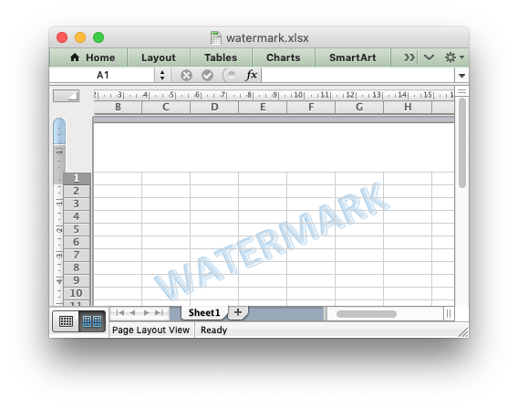

.. SPDX-License-Identifier: BSD-2-Clause
   Copyright 2013-2023, John McNamara, jmcnamara@cpan.org

.. _ex_watermark:

Example: Setting a Worksheet Watermark
=========================================

This program is an example of adding a worksheet watermark image using the
method recommended in the Microsoft documentation: `Add a watermark in Excel
<https://support.microsoft.com/en-us/office/add-a-watermark-in-excel-a372182a-d733-484e-825c-18ddf3edf009>`_.

.. literalinclude:: ../../../examples/watermark.py
