.. _format:

The Format Class
================

This section describes the methods and properties that are available for
formatting cells in Excel.

The properties of a cell that can be formatted include: fonts, colors,
patterns, borders, alignment and number formatting.

.. image:: _images/formats_intro.png

Creating and using a Format object
----------------------------------

Cell formatting is defined through a Format object. Format objects are created
by calling the workbook ``add_format()`` method as follows::

    format1 = workbook.add_format()       # Set properties later.
    format2 = workbook.add_format(props)  # Set properties at creation.

There are two ways of setting Format properties: by using the object interface
or by setting the property as a dictionary of key/value pairs in the
constructor. For example, a typical use of the object interface would be as
follows::

    format = workbook.add_format()
    format.set_bold()
    format.set_font_color('red')

By comparison the properties can be set by passing a dictionary of properties
to the `add_format()` constructor::

    format = workbook.add_format({'bold': True, 'font_color': 'red'})

In general the key/value interface is more flexible and clearer than the
object method and is the recommended method for setting format
properties. However, both methods produce the same result.

Once a Format object has been constructed and its properties have been set it
can be passed as an argument to the worksheet ``write`` methods as follows::

    worksheet.write       (0, 0, 'Foo', format)
    worksheet.write_string(1, 0, 'Bar', format)
    worksheet.write_number(2, 0, 3,     format)
    worksheet.write_blank (3, 0, '',    format)

Formats can also be passed to the worksheet ``set_row()`` and ``set_column()``
methods to define the default formatting properties for a row or column::

    worksheet.set_row(0, 18, format)
    worksheet.set_column('A:D', 20, format)

Format Defaults
---------------

The default Excel 2007+ cell format is Calibri 11 with all other properties off.

In general a format method call without an argument will turn a property on,
for example::

    format = workbook.add_format()

    format.set_bold()      # Turns bold on.
    format.set_bold(True)  # Also turns bold on.

Since most properties are already off by default it isn't generally required to
turn them off. However, it is possible if required::

    format.set_bold(False)  # Turns bold off.

Modifying Formats
-----------------

Each unique cell format in an XlsxWriter spreadsheet must have a corresponding
Format object. It isn't possible to use a Format with a ``write()`` method and
then redefine it for use at a later stage. This is because a Format is applied
to a cell not in its current state but in its final state. Consider the
following example::

    format = workbook.add_format({'bold': True, 'font_color': 'red'})
    worksheet.write('A1', 'Cell A1', format)

    # Later...
    format.set_font_color('green')
    worksheet.write('B1', 'Cell B1', format)

Cell A1 is assigned a format which initially has the font set to the color
red. However, the color is subsequently set to green. When Excel displays
Cell A1 it will display the final state of the Format which in this case will
be the color green.

Format methods and Format properties
------------------------------------

The following table shows the Excel format categories, the formatting
properties that can be applied and the equivalent object method:

+------------+------------------+----------------------+------------------------------+
| Category   | Description      | Property             | Method Name                  |
+============+==================+======================+==============================+
| Font       | Font type        | ``'font_name'``      | :func:`set_font_name()`      |
+------------+------------------+----------------------+------------------------------+
|            | Font size        | ``'font_size'``      | :func:`set_font_size()`      |
+------------+------------------+----------------------+------------------------------+
|            | Font color       | ``'font_color'``     | :func:`set_font_color()`     |
+------------+------------------+----------------------+------------------------------+
|            | Bold             | ``'bold'``           | :func:`set_bold()`           |
+------------+------------------+----------------------+------------------------------+
|            | Italic           | ``'italic'``         | :func:`set_italic()`         |
+------------+------------------+----------------------+------------------------------+
|            | Underline        | ``'underline'``      | :func:`set_underline()`      |
+------------+------------------+----------------------+------------------------------+
|            | Strikeout        | ``'font_strikeout'`` | :func:`set_font_strikeout()` |
+------------+------------------+----------------------+------------------------------+
|            | Super/Subscript  | ``'font_script'``    | :func:`set_font_script()`    |
+------------+------------------+----------------------+------------------------------+
| Number     | Numeric format   | ``'num_format'``     | :func:`set_num_format()`     |
+------------+------------------+----------------------+------------------------------+
| Protection | Lock cells       | ``'locked'``         | :func:`set_locked()`         |
+------------+------------------+----------------------+------------------------------+
|            | Hide formulas    | ``'hidden'``         | :func:`set_hidden()`         |
+------------+------------------+----------------------+------------------------------+
| Alignment  | Horizontal align | ``'align'``          | :func:`set_align()`          |
+------------+------------------+----------------------+------------------------------+
|            | Vertical align   | ``'valign'``         | :func:`set_align()`          |
+------------+------------------+----------------------+------------------------------+
|            | Rotation         | ``'rotation'``       | :func:`set_rotation()`       |
+------------+------------------+----------------------+------------------------------+
|            | Text wrap        | ``'text_wrap'``      | :func:`set_text_wrap()`      |
+------------+------------------+----------------------+------------------------------+
|            | Justify last     | ``'text_justlast'``  | :func:`set_text_justlast()`  |
+------------+------------------+----------------------+------------------------------+
|            | Center across    | ``'center_across'``  | :func:`set_center_across()`  |
+------------+------------------+----------------------+------------------------------+
|            | Indentation      | ``'indent'``         | :func:`set_indent()`         |
+------------+------------------+----------------------+------------------------------+
|            | Shrink to fit    | ``'shrink'``         | :func:`set_shrink()`         |
+------------+------------------+----------------------+------------------------------+
| Pattern    | Cell pattern     | ``'pattern'``        | :func:`set_pattern()`        |
+------------+------------------+----------------------+------------------------------+
|            | Background color | ``'bg_color'``       | :func:`set_bg_color()`       |
+------------+------------------+----------------------+------------------------------+
|            | Foreground color | ``'fg_color'``       | :func:`set_fg_color()`       |
+------------+------------------+----------------------+------------------------------+
| Border     | Cell border      | ``'border'``         | :func:`set_border()`         |
+------------+------------------+----------------------+------------------------------+
|            | Bottom border    | ``'bottom'``         | :func:`set_bottom()`         |
+------------+------------------+----------------------+------------------------------+
|            | Top border       | ``'top'``            | :func:`set_top()`            |
+------------+------------------+----------------------+------------------------------+
|            | Left border      | ``'left'``           | :func:`set_left()`           |
+------------+------------------+----------------------+------------------------------+
|            | Right border     | ``'right'``          | :func:`set_right()`          |
+------------+------------------+----------------------+------------------------------+
|            | Border color     | ``'border_color'``   | :func:`set_border_color()`   |
+------------+------------------+----------------------+------------------------------+
|            | Bottom color     | ``'bottom_color'``   | :func:`set_bottom_color()`   |
+------------+------------------+----------------------+------------------------------+
|            | Top color        | ``'top_color'``      | :func:`set_top_color()`      |
+------------+------------------+----------------------+------------------------------+
|            | Left color       | ``'left_color'``     | :func:`set_left_color()`     |
+------------+------------------+----------------------+------------------------------+
|            | Right color      | ``'right_color'``    | :func:`set_right_color()`    |
+------------+------------------+----------------------+------------------------------+

The format properties and methods are explained in the following sections.

format.set_font_name()
----------------------

.. py:function:: set_font_name(fontname)

   Set the font used in the cell.

   :param string fontname: Cell font.

Specify the font used used in the cell format::

    cell_format.set_font_name('Times New Roman')

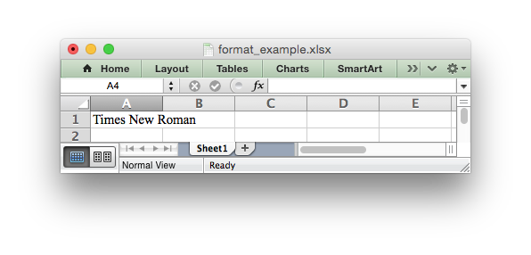

Excel can only display fonts that are installed on the system that it is
running on. Therefore it is best to use the fonts that come as standard such
as 'Calibri', 'Times New Roman' and 'Courier New'.

The default font for an unformatted cell in Excel 2007+ is 'Calibri'.

format.set_font_size()
----------------------

.. py:function:: set_font_size(size)

   Set the size of the font used in the cell.

   :param int size: The cell font size.

Set the font size of the cell format::

    format = workbook.add_format()
    format.set_font_size(30)

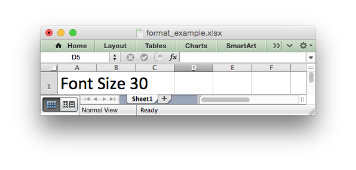

Excel adjusts the height of a row to accommodate the largest font size in the
row. You can also explicitly specify the height of a row using the
:func:`set_row()` worksheet method.

format.set_font_color()
-----------------------

.. py:function:: set_font_color(color)

   Set the color of the font used in the cell.

   :param string color: The cell font color.

Set the font color::

    format = workbook.add_format()

    format.set_font_color('red')

    worksheet.write(0, 0, 'wheelbarrow', format)

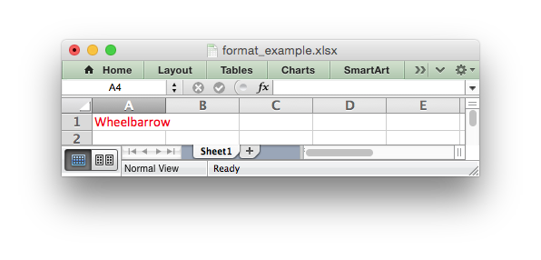

The color can be a Html style ``#RRGGBB`` string or a limited number of named
colors, see :ref:`colors`.

Note: The ``set_font_color()`` method is used to set the color of the font in
a cell. To set the color of a cell use the :func:`set_bg_color()` and
:func:`set_pattern()` methods.

format.set_bold()
-----------------

.. py:function:: set_bold()

   Turn on bold for the format font.

Set the bold property of the font::

    format.set_bold()

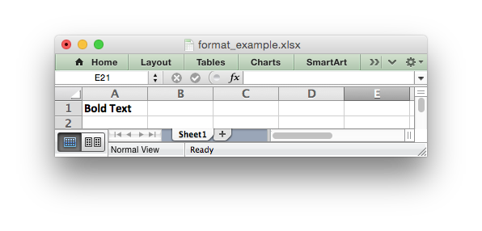

format.set_italic()
-------------------

.. py:function:: set_italic()

   Turn on italic for the format font.

Set the italic property of the font::

    format.set_italic()

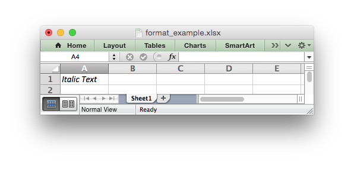

format.set_underline()
----------------------

.. py:function:: set_underline()

   Turn on underline for the format.

   :param int style: Underline style.

Set the underline property of the format::

    format.set_underline()

The available underline styles are:

* 1 = Single underline (the default)
* 2 = Double underline
* 33 = Single accounting underline
* 34 = Double accounting underline

format.set_font_strikeout()
---------------------------

.. py:function:: set_font_strikeout()

   Set the strikeout property of the font.

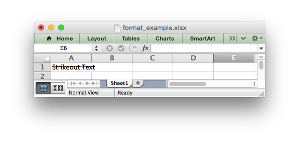

format.set_font_script()
------------------------

.. py:function:: set_font_script()

   Set the superscript/subscript property of the font.

The available options are:

* 1 = Superscript
* 2 = Subscript

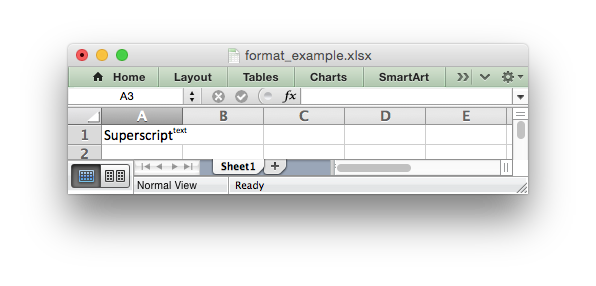

This property is generally only useful when used in conjunction with :func:`write_rich_string()`.

format.set_num_format()
-----------------------

.. py:function:: set_num_format(format_string)

   Set the number format for a cell.

   :param string format_string: The cell number format.

This method is used to define the numerical format of a number in Excel. It
controls whether a number is displayed as an integer, a floating point number,
a date, a currency value or some other user defined format.

The numerical format of a cell can be specified by using a format string or an
index to one of Excel's built-in formats::

    format1 = workbook.add_format()
    format2 = workbook.add_format()

    format1.set_num_format('d mmm yyyy')  # Format string.
    format2.set_num_format(0x0F)          # Format index.

Format strings can control any aspect of number formatting allowed by Excel::

    format01.set_num_format('0.000')
    worksheet.write(1, 0, 3.1415926, format01)       # -> 3.142

    format02.set_num_format('#,##0')
    worksheet.write(2, 0, 1234.56, format02)         # -> 1,235

    format03.set_num_format('#,##0.00')
    worksheet.write(3, 0, 1234.56, format03)         # -> 1,234.56

    format04.set_num_format('0.00')
    worksheet.write(4, 0, 49.99, format04)           # -> 49.99

    format05.set_num_format('mm/dd/yy')
    worksheet.write(5, 0, 36892.521, format05)       # -> 01/01/01

    format06.set_num_format('mmm d yyyy')
    worksheet.write(6, 0, 36892.521, format06)       # -> Jan 1 2001

    format07.set_num_format('d mmmm yyyy')
    worksheet.write(7, 0, 36892.521, format07)       # -> 1 January 2001

    format08.set_num_format('dd/mm/yyyy hh:mm AM/PM')
    worksheet.write(8, 0, 36892.521, format08)      # -> 01/01/2001 12:30 AM

    format09.set_num_format('0 "dollar and" .00 "cents"')
    worksheet.write(9, 0, 1.87, format09)           # -> 1 dollar and .87 cents

    # Conditional numerical formatting.
    format10.set_num_format('[Green]General;[Red]-General;General')
    worksheet.write(10, 0, 123, format10)  # > 0 Green
    worksheet.write(11, 0, -45, format10)  # < 0 Red
    worksheet.write(12, 0,   0, format10)  # = 0 Default color

    # Zip code.
    format11.set_num_format('00000')
    worksheet.write(13, 0, 1209, format11)

.. image:: _images/formats_num_str.png

The number system used for dates is described in
:ref:`working_with_dates_and_time`.

The color format should have one of the following values::

    [Black] [Blue] [Cyan] [Green] [Magenta] [Red] [White] [Yellow]

For more information refer to the
`Microsoft documentation on cell formats <http://office.microsoft.com/en-gb/assistance/HP051995001033.aspx>`_.

Excel's built-in formats are shown in the following table:

+-------+-------+--------------------------------------------------------+
| Index | Index | Format String                                          |
+=======+=======+========================================================+
| 0     | 0x00  | ``General``                                            |
+-------+-------+--------------------------------------------------------+
| 1     | 0x01  | ``0``                                                  |
+-------+-------+--------------------------------------------------------+
| 2     | 0x02  | ``0.00``                                               |
+-------+-------+--------------------------------------------------------+
| 3     | 0x03  | ``#,##0``                                              |
+-------+-------+--------------------------------------------------------+
| 4     | 0x04  | ``#,##0.00``                                           |
+-------+-------+--------------------------------------------------------+
| 5     | 0x05  | ``($#,##0_);($#,##0)``                                 |
+-------+-------+--------------------------------------------------------+
| 6     | 0x06  | ``($#,##0_);[Red]($#,##0)``                            |
+-------+-------+--------------------------------------------------------+
| 7     | 0x07  | ``($#,##0.00_);($#,##0.00)``                           |
+-------+-------+--------------------------------------------------------+
| 8     | 0x08  | ``($#,##0.00_);[Red]($#,##0.00)``                      |
+-------+-------+--------------------------------------------------------+
| 9     | 0x09  | ``0%``                                                 |
+-------+-------+--------------------------------------------------------+
| 10    | 0x0a  | ``0.00%``                                              |
+-------+-------+--------------------------------------------------------+
| 11    | 0x0b  | ``0.00E+00``                                           |
+-------+-------+--------------------------------------------------------+
| 12    | 0x0c  | ``# ?/?``                                              |
+-------+-------+--------------------------------------------------------+
| 13    | 0x0d  | ``# ??/??``                                            |
+-------+-------+--------------------------------------------------------+
| 14    | 0x0e  | ``m/d/yy``                                             |
+-------+-------+--------------------------------------------------------+
| 15    | 0x0f  | ``d-mmm-yy``                                           |
+-------+-------+--------------------------------------------------------+
| 16    | 0x10  | ``d-mmm``                                              |
+-------+-------+--------------------------------------------------------+
| 17    | 0x11  | ``mmm-yy``                                             |
+-------+-------+--------------------------------------------------------+
| 18    | 0x12  | ``h:mm AM/PM``                                         |
+-------+-------+--------------------------------------------------------+
| 19    | 0x13  | ``h:mm:ss AM/PM``                                      |
+-------+-------+--------------------------------------------------------+
| 20    | 0x14  | ``h:mm``                                               |
+-------+-------+--------------------------------------------------------+
| 21    | 0x15  | ``h:mm:ss``                                            |
+-------+-------+--------------------------------------------------------+
| 22    | 0x16  | ``m/d/yy h:mm``                                        |
+-------+-------+--------------------------------------------------------+
| ...   | ...   | ...                                                    |
+-------+-------+--------------------------------------------------------+
| 37    | 0x25  | ``(#,##0_);(#,##0)``                                   |
+-------+-------+--------------------------------------------------------+
| 38    | 0x26  | ``(#,##0_);[Red](#,##0)``                              |
+-------+-------+--------------------------------------------------------+
| 39    | 0x27  | ``(#,##0.00_);(#,##0.00)``                             |
+-------+-------+--------------------------------------------------------+
| 40    | 0x28  | ``(#,##0.00_);[Red](#,##0.00)``                        |
+-------+-------+--------------------------------------------------------+
| 41    | 0x29  | ``_(* #,##0_);_(* (#,##0);_(* "-"_);_(@_)``            |
+-------+-------+--------------------------------------------------------+
| 42    | 0x2a  | ``_($* #,##0_);_($* (#,##0);_($* "-"_);_(@_)``         |
+-------+-------+--------------------------------------------------------+
| 43    | 0x2b  | ``_(* #,##0.00_);_(* (#,##0.00);_(* "-"??_);_(@_)``    |
+-------+-------+--------------------------------------------------------+
| 44    | 0x2c  | ``_($* #,##0.00_);_($* (#,##0.00);_($* "-"??_);_(@_)`` |
+-------+-------+--------------------------------------------------------+
| 45    | 0x2d  | ``mm:ss``                                              |
+-------+-------+--------------------------------------------------------+
| 46    | 0x2e  | ``[h]:mm:ss``                                          |
+-------+-------+--------------------------------------------------------+
| 47    | 0x2f  | ``mm:ss.0``                                            |
+-------+-------+--------------------------------------------------------+
| 48    | 0x30  | ``##0.0E+0``                                           |
+-------+-------+--------------------------------------------------------+
| 49    | 0x31  | ``@``                                                  |
+-------+-------+--------------------------------------------------------+

.. note::

   Numeric formats 23 to 36 are not documented by Microsoft and may differ
   in international versions. The listed date and currency formats may also
   vary depending on system settings.

.. note::

   The dollar sign in the above format appears as the defined local currency
   symbol.

format.set_locked()
-------------------

.. py:function:: set_locked(state)

   Set the cell locked state.

   :param bool state: Turn cell locking on or off. Defaults to True.

This property can be used to prevent modification of a cells contents.
Following Excel's convention, cell locking is turned on by default. However,
it only has an effect if the worksheet has been protected using the worksheet
:func:`protect()` method::

    locked = workbook.add_format()
    locked.set_locked(True)

    unlocked = workbook.add_format()
    locked.set_locked(False)

    # Enable worksheet protection
    worksheet.protect()

    # This cell cannot be edited.
    worksheet.write('A1', '=1+2', locked)

    # This cell can be edited.
    worksheet.write('A2', '=1+2', unlocked)

format.set_hidden()
-------------------

.. py:function:: set_hidden()

   Hide formulas in a cell.

This property is used to hide a formula while still displaying its result. This
is generally used to hide complex calculations from end users who are only
interested in the result. It only has an effect if the worksheet has been
protected using the worksheet :func:`protect()` method::

    hidden = workbook.add_format()
    hidden.set_hidden()

    # Enable worksheet protection
    worksheet.protect()

    # The formula in this cell isn't visible
    worksheet.write('A1', '=1+2', hidden)

format.set_align()
------------------

.. py:function:: set_align(alignment)

   Set the alignment for data in the cell.

   :param string alignment: The vertical and or horizontal alignment direction.

This method is used to set the horizontal and vertical text alignment within a
cell. The following are the available horizontal alignments:

+----------------------+
| Horizontal alignment |
+======================+
| center               |
+----------------------+
| right                |
+----------------------+
| fill                 |
+----------------------+
| justify              |
+----------------------+
| center_across        |
+----------------------+

The following are the available vertical alignments:

+--------------------+
| Vertical alignment |
+====================+
| top                |
+--------------------+
| vcenter            |
+--------------------+
| bottom             |
+--------------------+
| vjustify           |
+--------------------+

As in Excel, vertical and horizontal alignments can be combined::

    format = workbook.add_format()

    format.set_align('center')
    format.set_align('vcenter')

    worksheet.set_row(0, 70)
    worksheet.set_column('A:A', 30)

    worksheet.write(0, 0, 'Some Text', format)

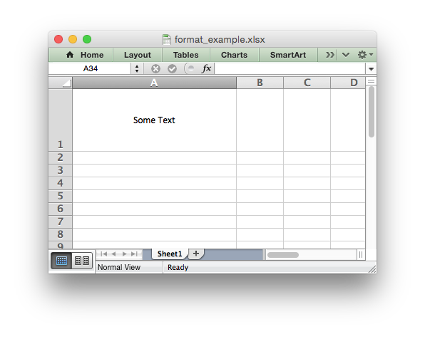

Text can be aligned across two or more adjacent cells using the
``'center_across'`` property. However, for genuine merged cells it is better
to use the ``merge_range()`` worksheet method.

The ``'vjustify'`` (vertical justify) option can be used to provide automatic
text wrapping in a cell. The height of the cell will be adjusted to
accommodate the wrapped text. To specify where the text wraps use the
``set_text_wrap()`` method.

format.set_center_across()
--------------------------

.. py:function:: set_center_across()

   Center text across adjacent cells.

Text can be aligned across two or more adjacent cells using the
``set_center_across()`` method. This is an alias for the
``set_align('center_across')`` method call.

Only one cell should contain the text, the other cells should be blank::

    format = workbook.add_format()
    format.set_center_across()

    worksheet.write(1, 1, 'Center across selection', format)
    worksheet.write_blank(1, 2, '', format)

For actual merged cells it is better to use the ``merge_range()`` worksheet
method.

format.set_text_wrap()
----------------------

.. py:function:: set_text_wrap()

   Wrap text in a cell.

Turn text wrapping on for text in a cell::

    format = workbook.add_format()
    format.set_text_wrap()

    worksheet.write(0, 0, "Some long text to wrap in a cell", format)

If you wish to control where the text is wrapped you can add newline characters
to the string::

    worksheet.write(2, 0, "It's\na bum\nwrap", format)

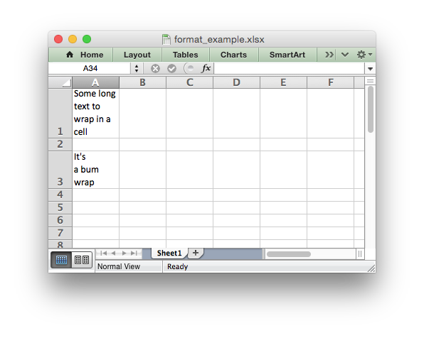

Excel will adjust the height of the row to accommodate the wrapped text. A
similar effect can be obtained without newlines using the
``set_align('vjustify')`` method.

format.set_rotation()
---------------------

.. py:function:: set_rotation(angle)

   Set the rotation of the text in a cell.

   :param int angle: Rotation angle in the range -90 to 90 and 270.

Set the rotation of the text in a cell. The rotation can be any angle in the
range -90 to 90 degrees::

    format = workbook.add_format()
    format.set_rotation(30)

    worksheet.write(0, 0, 'This text is rotated', format)

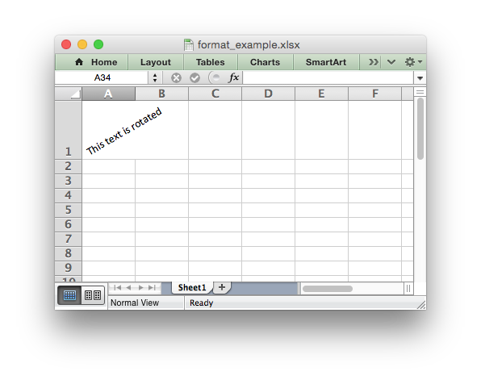

The angle 270 is also supported. This indicates text where the letters run from
top to bottom.

format.set_indent()
-------------------

.. py:function:: set_indent(level)

   Set the cell text indentation level.

   :param int level: Indentation level.

This method can be used to indent text in a cell. The argument, which should be
an integer, is taken as the level of indentation::

    format1 = workbook.add_format()
    format2 = workbook.add_format()

    format1.set_indent(1)
    format2.set_indent(2)

    worksheet.write('A1', 'This text is indented 1 level', format1)
    worksheet.write('A2', 'This text is indented 2 levels', format2)

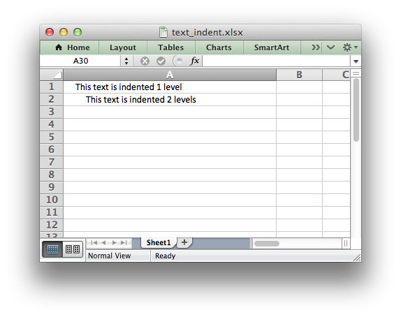

Indentation is a horizontal alignment property. It will override any other
horizontal properties but it can be used in conjunction with vertical
properties.

format.set_shrink()
-------------------

.. py:function:: set_shrink()

   Turn on the text "shrink to fit" for a cell.

This method can be used to shrink text so that it fits in a cell::

    format = workbook.add_format()
    format.set_shrink()

    worksheet.write(0, 0, 'Honey, I shrunk the text!', format)

format.set_text_justlast()
--------------------------

.. py:function:: set_text_justlast()

   Turn on the justify last text property.

Only applies to Far Eastern versions of Excel.

format.set_pattern()
--------------------

.. py:function:: set_pattern(index)

   :param int index: Pattern index. 0 - 18.

Set the background pattern of a cell.

The most common pattern is 1 which is a solid fill of the background color.

format.set_bg_color()
---------------------

.. py:function:: set_bg_color(color)

   Set the color of the background pattern in a cell.

   :param string color: The cell font color.

The ``set_bg_color()`` method can be used to set the background color of a
pattern. Patterns are defined via the ``set_pattern()`` method. If a pattern
hasn't been defined then a solid fill pattern is used as the default.

Here is an example of how to set up a solid fill in a cell::

    format = workbook.add_format()

    format.set_pattern(1)  # This is optional when using a solid fill.
    format.set_bg_color('green')

    worksheet.write('A1', 'Ray', format)

.. image:: _images/formats_set_bg_color.png

The color can be a Html style ``#RRGGBB`` string or a limited number of named
colors, see :ref:`colors`.

format.set_fg_color()
---------------------

.. py:function:: set_fg_color(color)

   Set the color of the foreground pattern in a cell.

   :param string color: The cell font color.

The ``set_fg_color()`` method can be used to set the foreground color of a
pattern.

The color can be a Html style ``#RRGGBB`` string or a limited number of named
colors, see :ref:`colors`.

format.set_border()
-------------------

.. py:function:: set_border(style)

   Set the cell border style.

   :param int style: Border style index. Default is 1.

Individual border elements can be configured using the following methods with
the same parameters:

* :func:`set_bottom()`
* :func:`set_top()`
* :func:`set_left()`
* :func:`set_right()`

A cell border is comprised of a border on the bottom, top, left and right.
These can be set to the same value using ``set_border()`` or individually
using the relevant method calls shown above.

The following shows the border styles sorted by XlsxWriter index number:

+-------+---------------+--------+-----------------+
| Index | Name          | Weight | Style           |
+=======+===============+========+=================+
| 0     | None          | 0      |                 |
+-------+---------------+--------+-----------------+
| 1     | Continuous    | 1      | ``-----------`` |
+-------+---------------+--------+-----------------+
| 2     | Continuous    | 2      | ``-----------`` |
+-------+---------------+--------+-----------------+
| 3     | Dash          | 1      | ``- - - - - -`` |
+-------+---------------+--------+-----------------+
| 4     | Dot           | 1      | ``. . . . . .`` |
+-------+---------------+--------+-----------------+
| 5     | Continuous    | 3      | ``-----------`` |
+-------+---------------+--------+-----------------+
| 6     | Double        | 3      | ``===========`` |
+-------+---------------+--------+-----------------+
| 7     | Continuous    | 0      | ``-----------`` |
+-------+---------------+--------+-----------------+
| 8     | Dash          | 2      | ``- - - - - -`` |
+-------+---------------+--------+-----------------+
| 9     | Dash Dot      | 1      | ``- . - . - .`` |
+-------+---------------+--------+-----------------+
| 10    | Dash Dot      | 2      | ``- . - . - .`` |
+-------+---------------+--------+-----------------+
| 11    | Dash Dot Dot  | 1      | ``- . . - . .`` |
+-------+---------------+--------+-----------------+
| 12    | Dash Dot Dot  | 2      | ``- . . - . .`` |
+-------+---------------+--------+-----------------+
| 13    | SlantDash Dot | 2      | ``/ - . / - .`` |
+-------+---------------+--------+-----------------+

The following shows the borders in the order shown in the Excel Dialog:

+-------+-----------------+-------+-----------------+
| Index | Style           | Index | Style           |
+=======+=================+=======+=================+
| 0     | None            | 12    | ``- . . - . .`` |
+-------+-----------------+-------+-----------------+
| 7     | ``-----------`` | 13    | ``/ - . / - .`` |
+-------+-----------------+-------+-----------------+
| 4     | ``. . . . . .`` | 10    | ``- . - . - .`` |
+-------+-----------------+-------+-----------------+
| 11    | ``- . . - . .`` | 8     | ``- - - - - -`` |
+-------+-----------------+-------+-----------------+
| 9     | ``- . - . - .`` | 2     | ``-----------`` |
+-------+-----------------+-------+-----------------+
| 3     | ``- - - - - -`` | 5     | ``-----------`` |
+-------+-----------------+-------+-----------------+
| 1     | ``-----------`` | 6     | ``===========`` |
+-------+-----------------+-------+-----------------+

format.set_bottom()
-------------------

.. py:function:: set_bottom(style)

   Set the cell bottom border style.

   :param int style: Border style index. Default is 1.

Set the cell bottom border style. See :func:`set_border` for details on the
border styles.

format.set_top()
----------------

.. py:function:: set_top(style)

   Set the cell top border style.

   :param int style: Border style index. Default is 1.

Set the cell top border style. See :func:`set_border` for details on the border
styles.

format.set_left()
-----------------

.. py:function:: set_left(style)

   Set the cell left border style.

   :param int style: Border style index. Default is 1.

Set the cell left border style. See :func:`set_border` for details on the
border styles.

format.set_right()
------------------

.. py:function:: set_right(style)

   Set the cell right border style.

   :param int style: Border style index. Default is 1.

Set the cell right border style. See :func:`set_border` for details on the
border styles.

format.set_border_color()
-------------------------

.. py:function:: set_border_color(color)

   Set the color of the cell border.

   :param string color: The cell border color.

Individual border elements can be configured using the following methods with
the same parameters:

* :func:`set_bottom_color()`
* :func:`set_top_color()`
* :func:`set_left_color()`
* :func:`set_right_color()`

Set the color of the cell borders. A cell border is comprised of a border on
the bottom, top, left and right. These can be set to the same color using
``set_border_color()`` or individually using the relevant method calls shown
above.

The color can be a Html style ``#RRGGBB`` string or a limited number of named
colors, see :ref:`colors`.

format.set_bottom_color()
-------------------------

.. py:function:: set_bottom_color(color)

   Set the color of the bottom cell border.

   :param string color: The cell border color.

See :func:`set_border_color` for details on the border colors.

format.set_top_color()
----------------------

.. py:function:: set_top_color(color)

   Set the color of the top cell border.

   :param string color: The cell border color.

See :func:`set_border_color` for details on the border colors.

format.set_left_color()
-----------------------

.. py:function:: set_left_color(color)

   Set the color of the left cell border.

   :param string color: The cell border color.

See :func:`set_border_color` for details on the border colors.

format.set_right_color()
------------------------

.. py:function:: set_right_color(color)

   Set the color of the right cell border.

   :param string color: The cell border color.

See :func:`set_border_color` for details on the border colors.

format.set_diag_border()
------------------------

.. py:function:: set_diag_border(style)

   Set the diagonal cell border style.

   :param int style: Border style index. Default is 1.

Set the style for a diagonal border. The `style` is the same as those used in
:func:`set_border`.

See :ref:`ex_diagonal_border`.

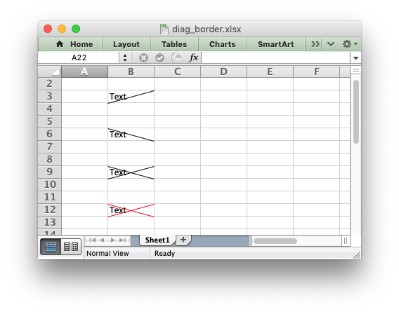

format.set_diag_type()
------------------------

.. py:function:: set_diag_type(style)

   Set the diagonal cell border type.

   :param int style: Border type, 1-3. No default.

Set the type of the diagonal border. The `style` should be one of the
following values:

1. From bottom left to top right.
2. From top left to bottom right.
3. Same as type 1 and 2 combined.

format.set_diag_color()
-----------------------

.. py:function:: set_diag_color(color)

   Set the color of the diagonal cell border.

   :param string color: The cell border color.

See :func:`set_border_color` for details on the border colors.
